# Challenge 2: Develop an App with GitHub Copilot - Solution Guide

## Task 1: Develop an App

### Login to GitHub

- Login to [GitHub](https://github.com/login) with the CloudLabs provided GitHub account. Ensure that you are logged in to the correct GitHub account provided for this lab session.

### Fork the Repository

- Navigate to the provided GitHub repository link: [MyMvcApp-Contact-Databse-Application](https://github.com/CloudLabsAI-Azure/MyMvcApp-Contact-Databse-Application.git).

    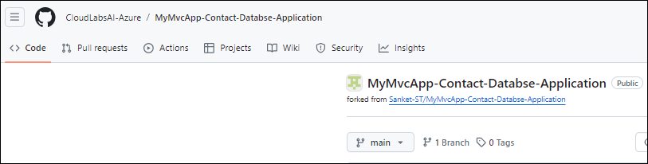

- Fork the repository into the CloudLabs provided GitHub account.

    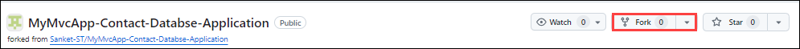

### Open Visual Studio and Clone Repository

- Launch Visual Studio and click on **Clone Git repository**.

   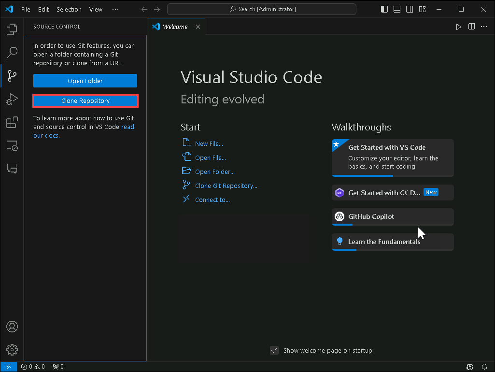

- Enter the Git Repository URL and click enter

    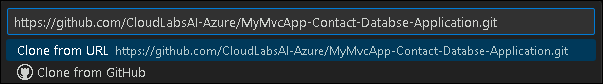

- You will have create a folder and select it.

    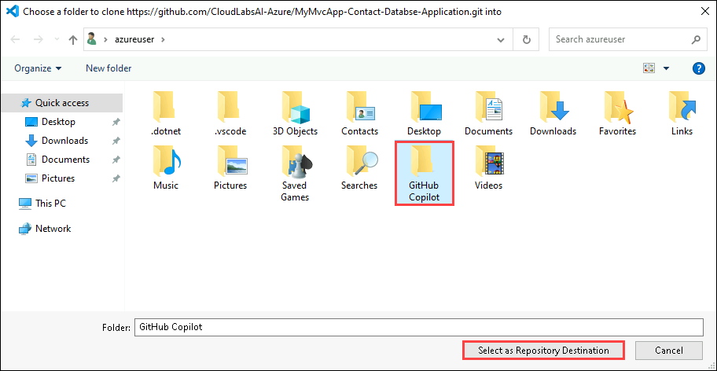

- The window will look like this.

    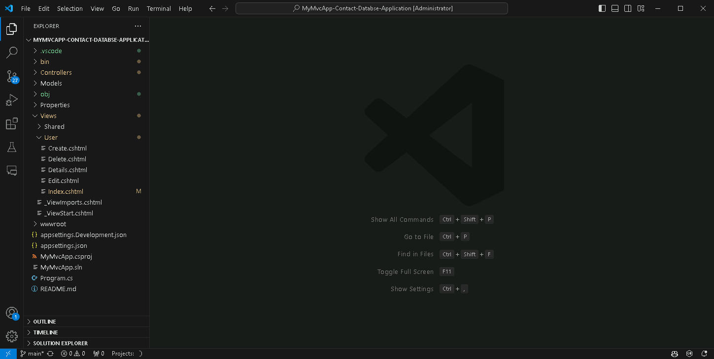


### Setting Up Visual Studio Code

- In the Visual Studio Code select the **Extensions option**, search for **GitHub Copilot** and click **Install**.

- Wait for the GitHub Copilot extension to download completely (this might take a few minutes) and close the Visual Studio Code Extension.

- Re-launch the Visual Studio and verify that the GitHub Copilot is active. The GitHub Copilot Chat window can now be utlized.

- Lets Navigate to Extentions 

  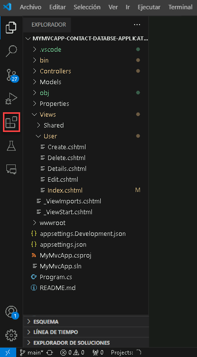

- Install **Nuget Gallery** and **C# Dev Kit**

  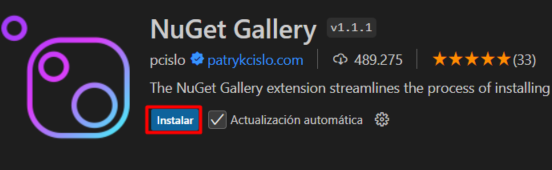  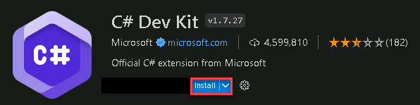

- Run the below command on the console.

    ```
    Update-Package Microsoft.CodeDom.Providers.DotNetCompilerPlatform -r
    ```

    

### Implement Methods using GitHub Copilot

- Navigate to the `UserController.cs` file within the `Controllers` folder.

    

- Use GitHub Copilot to generate code for each empty method in the `UserController.cs` file. To generate code for each empty method using GitHub Copilot, Select or highlight the lines of the empty method, and then right-click on the highlighted lines to open the context menu. 

    

    

- From the context menu, choose the "Copilot" option and click on "Fix This"

    

- GitHub Copilot will generate a code suggestion based on the context of the method. Review the suggestion provided by GitHub Copilot, and you can choose to accept or discard the suggestion based on its relevance to your requirements.

    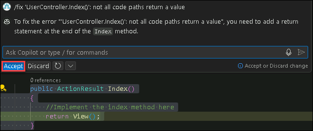

- Repeat this process for each empty method in the UserController.cs file until all methods are implemented.

- Following these steps will allow you to efficiently utilize GitHub Copilot to generate code for each empty method in the UserController.cs file.

### Run and test the Application

- Locate the app file **MyMvcApp.csproj** and right click **run in integreted terminal**.

   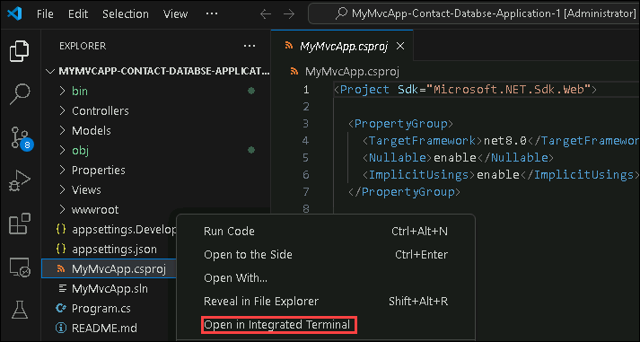

- We will have to run the code by the command **dotnet run**

- Sucessfull run will look like this

  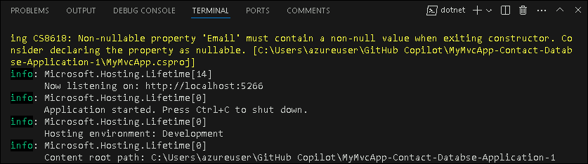

- Once the code runs and the build is sucesseful you can navigate to the URL for the app.
  
    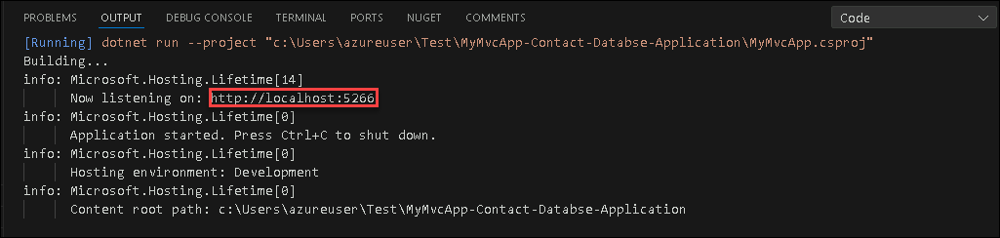


### Create a New Contact

- In the opened web browser, locate the "Create New" button and click on it.

    

- Fill in the required fields for Name and Email in the form provided. Click on the "Create" button to submit the form and create a new contact.

    

### Edit a Contact

- After creating a contact, return to the homepage.

- Find the contact you created in the list and locate the "Edit" button associated with it. Click on the "Edit" button.

    

- Modify the existing details (Name or Email) as desired. Save the changes by clicking on the "Save" button.

    

### Verify Details of a Contact

- Once again, return to the homepage.

- Locate the contact whose details you want to verify. Click on the "Details" button associated with that contact.

    

- Verify that the displayed details match the information you entered earlier.

    

### Delete a Contact

- From the homepage, find the contact you wish to delete.

- Click on the "Delete" button associated with that contact.

    

- A confirmation dialog will appear asking if you're sure you want to delete the contact. Confirm the action.

    

- Ensure that the contact is removed from the list after deletion.

    

By following these steps meticulously, you can thoroughly test the CRUD (Create, Read, Update, Delete) functionalities of the application and ensure its proper functioning.

# Task 2: Generate Unit Test Cases

- To generate unit test cases, we need to add a new Folder outside the exisiting project. Click on **Terminal** and use "dotnet new xunit -n MyMvcApp.Tests" a new file will be created.

   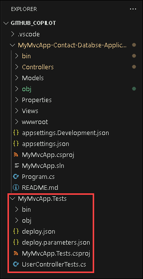

- We will have to refer the new project with the previous project **MyMvcApp-Contact-Databse-Application**

- Run the command dotnet add reference ../MyMvcApp-Contact-Databse-Application\MyMvcApp.csproj

  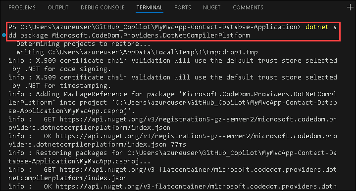

- Open Copilot and ask to *Generate test cases using xunit

  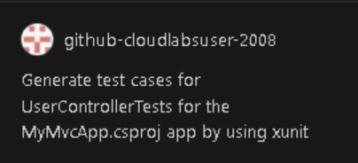

- Copy the code generated by Copilot which looks like the below code.

  ```
   using Xunit;
   using Microsoft.AspNetCore.Mvc;
   using MyMvcApp.Controllers;
   using MyMvcApp.Models;
   using System.Collections.Generic;
   using System.Linq;

    namespace MyApp.Tests
     {
        public class UserControllerTests
     {
        private UserController _controller;

        public UserControllerTests()
        {
            // Initialize UserController with an empty list for each test
            UserController.userlist = new List<User>();
            _controller = new UserController();
        }

        [Fact]
        public void Index_ReturnsViewResult_WithAListOfUsers()
        {
            // Arrange
            UserController.userlist.Add(new User { Id = 1, Name = "Test User 1", Email = "test1@example.com" });
            UserController.userlist.Add(new User { Id = 2, Name = "Test User 2", Email = "test2@example.com" });

            // Act
            var result = _controller.Index();

            // Assert
            var viewResult = Assert.IsType<ViewResult>(result);
            var model = Assert.IsAssignableFrom<IEnumerable<User>>(viewResult.Model);
            Assert.Equal(2, model.Count());
        }

        [Fact]
        public void Details_WithUnexistingId_ReturnsNotFound()
        {
            // Act
            var result = _controller.Details(99);

            // Assert
            Assert.IsType<NotFoundResult>(result);
        }

        [Fact]
        public void Details_WithExistingId_ReturnsViewResult()
        {
            // Arrange
            UserController.userlist.Add(new User { Id = 1, Name = "Test User", Email = "test@example.com" });

            // Act
            var result = _controller.Details(1);

            // Assert
            var viewResult = Assert.IsType<ViewResult>(result);
            var model = Assert.IsType<User>(viewResult.Model);
            Assert.Equal(1, model.Id);
        }

        [Fact]
        public void Create_PostValidUser_RedirectsToIndex()
        {
            // Arrange
            var user = new User { Id = 1, Name = "New User", Email = "new@example.com" };

            // Act
            var result = _controller.Create(user);

            // Assert
            var redirectToActionResult = Assert.IsType<RedirectToActionResult>(result);
            Assert.Equal("Index", redirectToActionResult.ActionName);
            Assert.Single(UserController.userlist);
        }

        [Fact]
        
        public void Create_PostInvalidUser_ReturnsViewWithModel()
        {
            // Arrange
            _controller.ModelState.AddModelError("Name", "Required");

            // Act
            var result = _controller.Create(new User());

            // Assert
            var viewResult = Assert.IsType<ViewResult>(result);
            Assert.False(viewResult.ViewData.ModelState.IsValid);
        }
      }
   }


- Rename the **UnitTest1.cs** file to **UserControllertest.cs** and paste the code inside that file.

  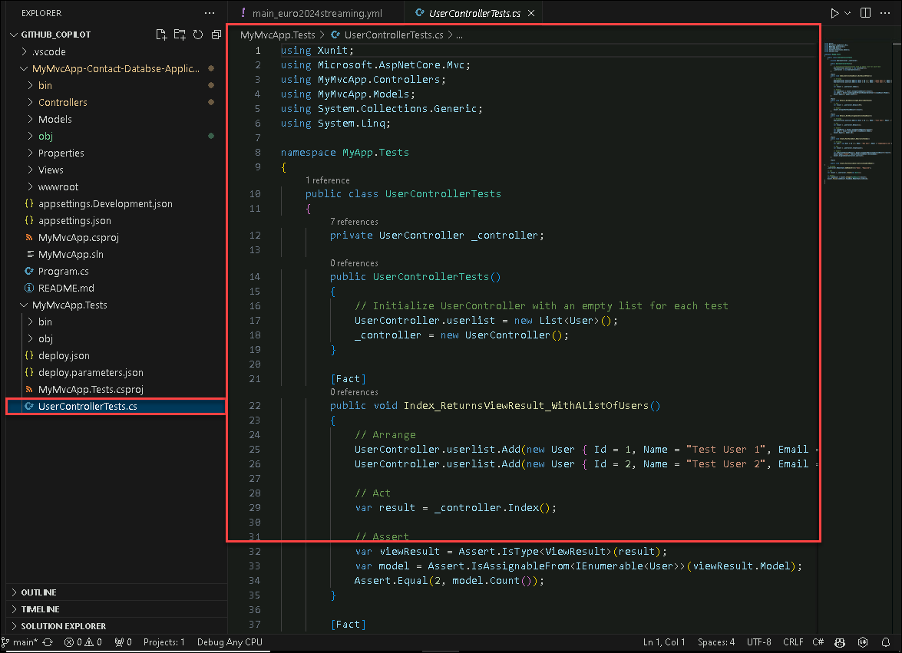
    
- Right click on the current project and open in Integrated terminal.

  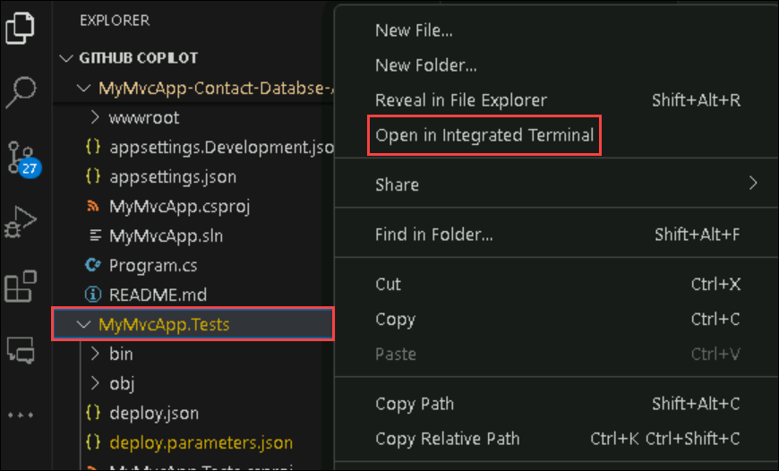

- Run the command dotnet test.

  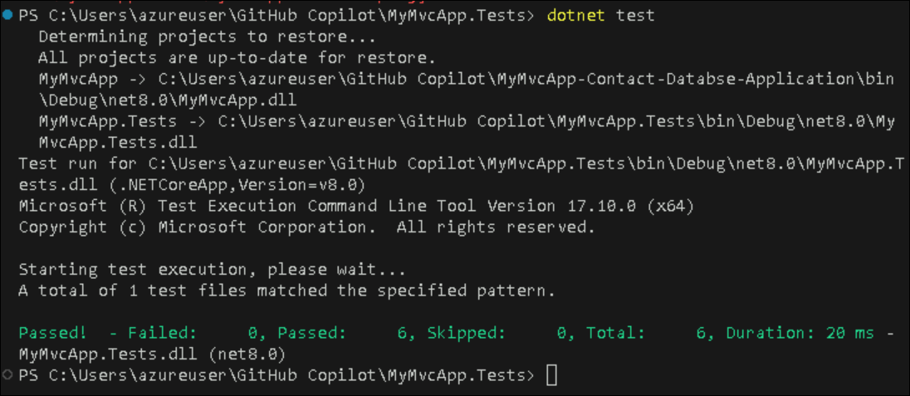


# Task 3: Develop and Test Features

### Utilize GitHub Copilot Chat for Feature Development:
  
   - Select "GitHub Copilot Chat" to open the GitHub Copilot Chat window.
  
        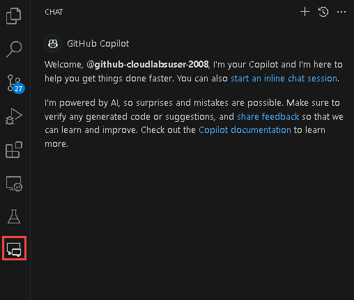

### Ask GitHub Copilot Chat for Feature Implementation:
   
   - Initiate a conversation with GitHub Copilot Chat by asking, "How can we add a search feature/functionality to our application?"

        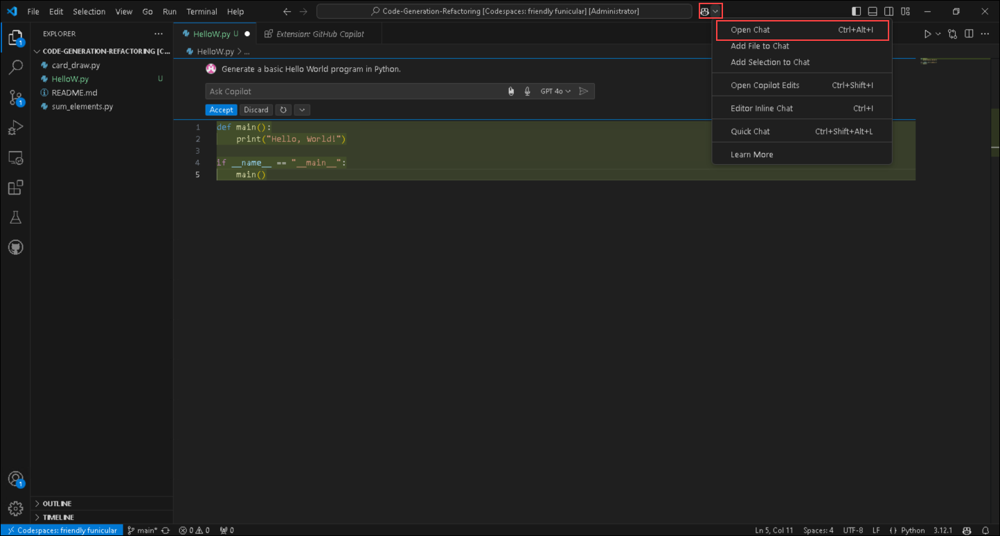

   - Based on the response generated by GitHub Copilot, proceed with implementing the suggested code.
  
   - In this case, GitHub Copilot suggested adding a new method to accept a search string as a parameter and filter the user list based on the search string before passing it to the view.

        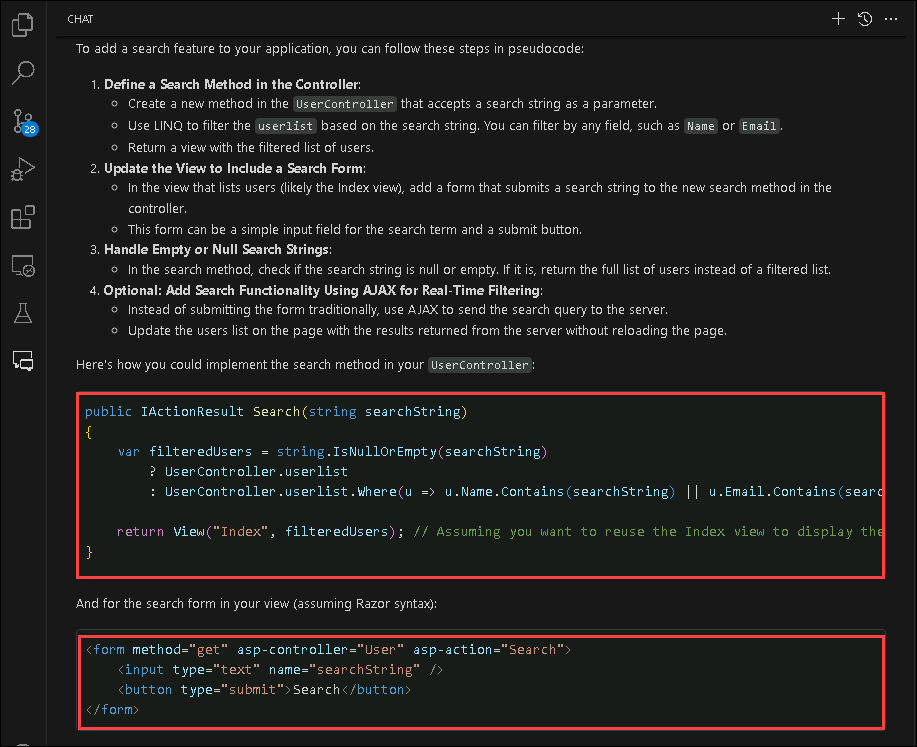

   - Copy and paste the provided code snippet into the `UserController.cs` file within the appropriate action method, typically the `Index` method. In this code, if a searchString is provided, the user list is filtered to only include users whose names contain the searchString. If no searchString is provided, all users are returned.

        ```
        // GET: User
        public ActionResult Index(string searchString)
        {
            var users = from u in userlist
            select u;
         if (!String.IsNullOrEmpty(searchString))
        {
            users = users.Where(s => s.Name.Contains(searchString));
        }
          return View(users.ToList());
        }
        
        ```

        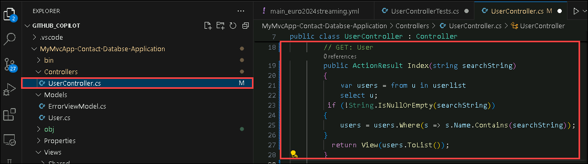

   - GitHub Copilot also suggested modifying the `Index.cshtml` file located in the path **Views\User\Index.cshtml** to include a form for the search string.

   - Copy and paste the provided code snippet found in the copilot chat into the `Index.cshtml` file. This form sends a GET request to the Index action method, passing the search string as a query string parameter.

        ```
          @using (Html.BeginForm("Index", "User", FormMethod.Get))
        {
           <p>
            Find by name: @Html.TextBox("searchString") 
            <input type="submit" value="Search" />
           </p>
         }
        ```

       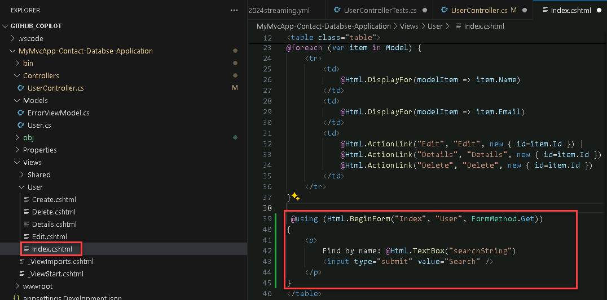

### Save Changes and Run the Application:

   - Save both the `UserController.cs` and `Index.cshtml` files after making the necessary changes.

   - Run the application by click on Terminal and by the command **dotnet run**. This action starts the application on localhost in a web browser.

        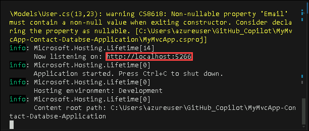

### Test the Search Functionality:

   - Add a couple of contact entries to the application by clicking on the "Create New" button and filling in the Name and Email fields.

        

   - Once contacts are added, test the search functionality by typing a contact name in the search field that was previously added. Click on the "Search" button to execute the search.

        

   - If the feature was implemented properly, you should be able to see the searched contact in the results.

        

By following these steps, you can effectively utilize GitHub Copilot to implement and test new features in your application, enhancing its functionality and usability.

# Task 4: Generating Commit Messages

The new Generated Commit Message feature uses GitHub Copilot AI to describe your code changes.  This makes writing descriptive and helpful commit messages as easy as clicking a button, and then adding your explanation.

- Locate the Git Changes and click on it.

    

- Use the new “Add AI Generated Commit Message” sparkle pen icon in the Git Changes window to generate a suggestion.

    

- GitHub Copilot will look at the file changes in your commit, summarize them, and then describe each change. You can then “Insert AI Suggestion” or “Discard.” Click on Commit All.

    

- Once it is committed locally, click on Push to push the changes into the repository.

    
