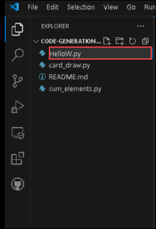
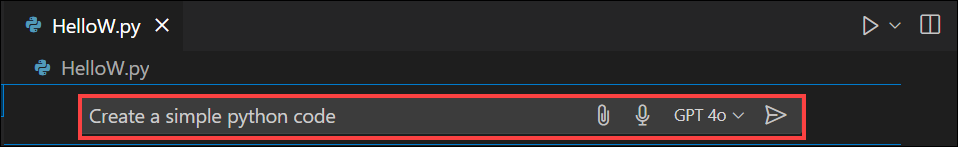
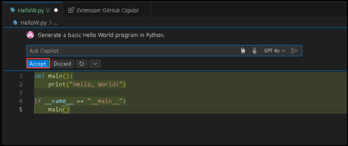
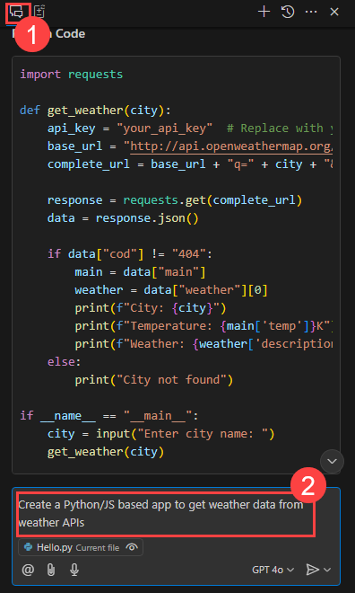

# Desafío 1: Primeros Pasos con GitHub Copilot - Guía de Soluciones

## Tarea 1: Configurar GitHub Copilot en VS Code

En esta tarea, instalará la extensión GitHub Copilot en VS Code.

1. Abra Visual Studio Code desde la pantalla del escritorio.
   
   

1. Haga clic en el ícono **Extensiones (1)** en la barra de actividades del lado izquierdo de la ventana de Visual Studio Code.
   
1. En el cuadro de búsqueda "**Buscar extensiones en Marketplace**", escriba y busque la extensión **GitHub Copilot (2)**.
   
1. Seleccione **GitHub Copilot (3)** de la lista de resultados.

1. Haga clic en el botón **Instalar (4)**.

   

## Tarea 2: Iniciar sesión con una Cuenta de GitHub

En esta tarea, iniciará sesión en su cuenta de GitHub a través de la extensión GitHub Copilot.

1. Después de la instalación, en la esquina inferior derecha, haga clic en el mensaje **Sign in to GitHub**.
   
   
   
1. Haga clic en **Permitir** en la ventana emergente.

   

1. En la página de inicio de sesión de GitHub, ingrese sus credenciales de GitHub y haga clic en **Sign in**.

1. Para verificar el inicio de sesión de su cuenta de GitHub, inicie sesión en Outlook en la Máquina Virtual del Laboratorio (labVM) en una ventana **Privada** (https://outlook.office365.com/mail/) con sus credenciales de GitHub, busque el correo electrónico que contiene el código de verificación y seleccione **Verify**.

1. Haga clic en **Authorize Visual-Studio-Code** para proporcionar permisos adicionales a GitHub para VS Code.

## Tarea 3: Usar GitHub Codespaces con Copilot

En esta tarea, creará un nuevo codespace para su repositorio de GitHub y usará la extensión GitHub Codespaces para confirmar y enviar cambios directamente desde VS Code al repositorio de GitHub que haya seleccionado.

1. Bifurque el repositorio https://github.com/CloudLabsAI-Azure/Code-Generation-Refactoring. En la página de inicio de su repositorio, haga clic en la pestaña **Código (1)** ubicada en la parte superior izquierda de la pantalla. Haga clic en el botón **Código (2)** ubicado en el medio de la página.

1. Haga clic en la pestaña **Codespaces (1)** en el cuadro emergente y luego haga clic en el botón **Create codespace on main (2)**.

   >**Nota**: Si no aparece un mensaje emergente en el navegador para abrir Visual Studio Code, inicie Visual Studio Code manualmente desde el escritorio y ciérrelo. A continuación, vuelva al navegador, actualice la página e inicie el codespace creado anteriormente.

   

1. Si el Codespace no se abre en Visual Studio Code, diríjase a su repositorio de GitHub, haga clic en **Code**, haga clic en el botón de **puntos suspensivos** de su codespace actual y luego haga clic en **Open in Visual Studio Code**.

1. Aparecerá una ventana emergente. Haga clic en **Abrir** para continuar. Posteriormente, aparecerá otra ventana emergente dentro de Visual Studio Code (VS Code), donde deberá seleccionar nuevamente **Instalar extensión y Abrir URI** para continuar.

   

   

1. En la esquina inferior derecha, recibirá un mensaje para iniciar sesión en GitHub.

1. Luego, cuando aparezca la ventana emergente, haga clic en **Permitir**.

   >**Nota**: Espere alrededor de 2 minutos para que el codespace se active por sí solo.

   

1. Haga clic en **Authorize Visual-Studio-Code** una vez que aparezca la pestaña Authorize GitHub for VS Code en el navegador.

1. Verifique que su codespace esté en ejecución.

1. Ahora puede editar los archivos de su repositorio de GitHub, confirmar y enviar los cambios directamente a GitHub a través de VS Code.

## Tarea 4: Prueba de Funcionalidad de Copilot

En esta tarea, evaluará la funcionalidad de GitHub Copilot generando un fragmento de código simple utilizando Copilot Chat.

1. Cree un archivo con el nombre de su elección.

   

1. Presione **Ctrl + I** para solicitar a GitHub Copilot que escriba código por usted.
1. Cuando aparezca la ventana emergente de Copilot, solicite a Copilot que genere un código simple en Python.

   

1. Se generará un código básico de "Hola Mundo". Haga clic en **"Aceptar"** para insertarlo en el archivo recién creado.

   

Esto confirma que la funcionalidad de Copilot está funcionando correctamente.


## Tarea 5: Generar Código con Copilot y Copilot Chat

En esta tarea, creará un código Python/JS para construir una calculadora y usar claves API de OpenWeatherMap para obtener datos meteorológicos de APIs de clima.

1. Abra la ventana de chat de GitHub Copilot y solicite a GitHub Copilot que cree un código Python/JS para construir una calculadora utilizando el siguiente prompt.

   ```
   Create a Python/JS based code to build a calculator 
   ```

   

1. Observe cómo GitHub Copilot crea códigos para crear una calculadora en lenguajes Python y JS. Guarde los archivos para ejecutar pruebas.

   - Python code to build a calculator:
     ```
     def add(x, y):
     return x + y

     def subtract(x, y):
     return x - y

     def multiply(x, y):
     return x * y

     def divide(x, y):
     if y == 0:
        return "Error! Division by zero."
     else:
        return x / y

     print("Select operation:")
     print("1.Add")
     print("2.Subtract")
     print("3.Multiply")
     print("4.Divide")

     while True:
        choice = input("Enter choice(1/2/3/4): ")

        if choice in ('1', '2', '3', '4'):
          num1 = float(input("Enter first number: "))
          num2 = float(input("Enter second number: "))

     if choice == '1':
            print(num1, "+", num2, "=", add(num1, num2))

     elif choice == '2':
            print(num1, "-", num2, "=", subtract(num1, num2))

     elif choice == '3':
            print(num1, "*", num2, "=", multiply(num1, num2))

     elif choice == '4':
            print(num1, "/", num2, "=", divide(num1, num2))
     break

     else:

     print("Invalid Input")

     ```

   - JS code to build a calculator
     ```
      // Function to add two numbers
      function add(a, b) {
        return a + b;
      }

      // Function to subtract two numbers
      function subtract(a, b) {
        return a - b;
      }

      // Function to multiply two numbers
      function multiply(a, b) {
        return a * b;
      }

      // Function to divide two numbers
      function divide(a, b) {
        if (b === 0) {
          return "Error: Division by zero";
        }
        return a / b;
      }

      // Declare and assign values to num1 and num2
      var num1 = 5;
      var num2 = 3;

      console.log("Addition:", add(num1, num2));
      console.log("Subtraction:", subtract(num1, num2));
      console.log("Multiplication:", multiply(num1, num2));
      console.log("Division:", divide(num1, num2));
     ```
   > **Nota:** Declare las dos variables/números antes de ejecutar pruebas a través de JS.

1. Ejecute pruebas para los archivos experimentando con diferentes operaciones para verificar el funcionamiento de la calculadora.

1. Para obtener los datos del clima a partir de las APIs meteorológicas, primero inicie sesión en el sitio web de OpenWeatherMap API (https://openweathermap.org/) y, en el menú desplegable de su perfil de usuario en la parte superior derecha, haga clic en **My API keys**. Puede utilizar la clave de API predeterminada o crear una nueva para obtener los datos meteorológicos utilizando el código.

   

1. Abra la ventana de chat de GitHub Copilot y solicite a GitHub Copilot que cree una aplicación basada en Python/JS para obtener datos meteorológicos de las APIs de clima.

   ```
   Create a Python/JS based app to get weather data from weather APIs
   ```

   

1. Observe cómo GitHub Copilot crea código para obtener datos meteorológicos de las APIs de clima tanto en el lenguaje Python como en JS.

   - Python:
     ```
     import requests

     def get_weather(city):
       API_KEY = 'ENTER YOUR WEATHER API KEY HERE'
       BASE_URL = f"http://api.openweathermap.org/data/2.5/weather?q={city}&appid={API_KEY}"
       response = requests.get(BASE_URL)
       data = response.json()
       main = data['main']
       print(f"Temperature: {main['temp']}")
       print(f"Humidity: {main['humidity']}")
       print(f"Weather: {data['weather'][0]['description']}")

     city = input("Enter the city: ")
     get_weather(city)
     ```
   - JS:
     ```
     async function getWeather(city) {
        const API_KEY = 'ENTER YOUR WEATHER API KEY HERE';
        const BASE_URL = `http://api.openweathermap.org/data/2.5/weather?q=${city}&appid=${API_KEY}`;
        const response = await fetch(BASE_URL);
        const data = await response.json();
        console.log(`Temperature: ${data.main.temp}`);
        console.log(`Humidity: ${data.main.humidity}`);
        console.log(`Weather: ${data.weather[0].description}`);
     }

     const city = 'Mumbai';  // Replace with the city you want to get the weather for
     getWeather(city);
     ```
   > **Nota:** Ingrese el nombre de la ciudad antes de ejecutar las pruebas en JS.

1. Ejecute pruebas para los archivos introduciendo diferentes ciudades para verificar que los datos de clima se obtengan de las APIs meteorológicas.

1. Envíe los archivos a su repositorio de GitHub bifurcado **CloudLabsAI-Azure/Code-Generation-Refactoring**.

Aquí tienes la traducción al español:  

---  

## Tarea 6: Refactorización y Depuración de Código con GitHub Copilot  

En esta tarea, refactorizarás y depurarás códigos de Python mal escritos utilizando GitHub Copilot y probarás algunos escenarios.  

1. Abre el archivo **sum_elements.py** haciendo doble clic en él.  

1. Selecciona todo el código, haz clic derecho y selecciona **Refactorizar**, luego elige *Modificar usando Copilot* y solicita a Copilot que refactorice el código seleccionado.  

1. Notarás que GitHub Copilot ha refactorizado y corregido el código.  

   ```python
   # Un ejemplo mal escrito de un programa en Python. Solicita al usuario el número de elementos a sumar, toma esos números enteros como entrada y maneja algunos casos de error básicos.

   MAX = 100

   def calculate_sum(arr):
      return sum(arr)

   def main():
      try:
         n = int(input("Ingrese el número de elementos (1-100): "))
         if not 1 <= n <= MAX:
            print("Entrada no válida. Por favor, proporcione un número del 1 al 100.")
            exit(1)

         arr = []

         print(f"Ingrese {n} números enteros:")
         for _ in range(n):
            try:
               arr.append(int(input()))
            except ValueError:
               print("Entrada no válida. Por favor, ingrese números enteros válidos.")
               exit(1)

         total = calculate_sum(arr)

         print("Suma de los números:", total)

      except KeyboardInterrupt:
         print("\nPrograma terminado por el usuario.")
         exit(1)

   if __name__ == "__main__":
      main()
   ```

1. Acepta los cambios, guarda el archivo y ejecuta algunos casos de prueba para verificar que el código refactorizado por GitHub Copilot sea preciso.  

1. Abre el archivo **card_draw.py** haciendo doble clic en él.  

1. Selecciona todo el código, haz clic derecho y haz clic en **Copilot**, luego selecciona **Fix** para depurar el código seleccionado.  

1. Notarás que GitHub Copilot ha depurado y corregido el código.  

   ```python
   # Programa de Python con errores intencionales

   # Importación de módulos
   import itertools
   import random

   # Crear una baraja de cartas
   deck = list(itertools.product(range(1, 14), ['Espadas', 'Corazones', 'Diamantes', 'Tréboles']))

   # Barajar las cartas
   random.shuffle(deck)

   # Robar cinco cartas
   print("Has obtenido:")
   for i in range(5):
      print(deck[i][0], "de", deck[i][1])
   ```

1. Acepta los cambios, guarda el archivo y ejecuta algunos casos de prueba para verificar que el código depurado por GitHub Copilot funcione como se espera.  
