# Challenge 1: Getting Started with GitHub Copilot - Solution Guide

## Task 1: Setup Github Copilot in VS Code

In this task, you'll be installing GitHub Copilot extension in VS Code.

1. Open Visual Studio Code from the desktop screen.
   
   

1. Click on the **Extensions (1)** icon in the activity bar on the left side of the Visual Studio Code window.
   
1. In the "**Search Extensions in Marketplace**" search box, type and search for the **GitHub Copilot (2)** extension.
   
1. Select **GitHub Copilot (3)** from the list of results.

1. Click on the **Install (4)** button.

   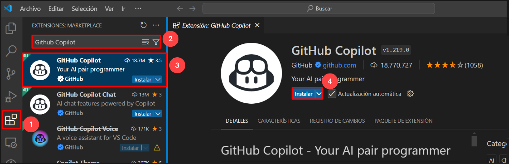

## Task 2: Login with GitHub Account

In this task, you'll be signing in to your GitHub account through GitHub Copilot extension.

1. After installation, at the bottom right corner, click on the **Sign in to GitHub** prompt.
   
   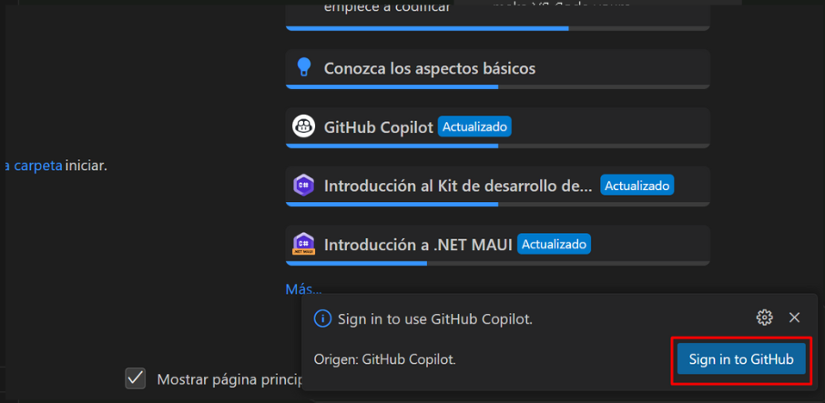
   
1. Click on **Allow** in the popup.

   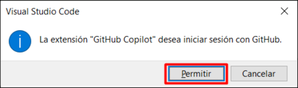

1. In the GitHub sign-in page, enter your GitHub credentials and click on **Sign in**.

1. To verify your GitHub account login, sign in to Outlook in the Lab VM through an **InPrivate** window (https://outlook.office365.com/mail/) using your GitHub credentials, locate the email containing the verification code and select **Verify**.

1. Click on **Authorize Visual-Studio-Code** to provide additional permissions to GitHub for VS Code.

## Task 3: Using GitHub Codespaces with Copilot

In this task, you'll create a new codespace for your GitHub repository and use GitHub Codespaces extension to commit and push changes directly from VS Code to your chosen GitHub repository.

1. On the home page of your repository, click the **Code** **(1)** tab located at the top left of the screen. Click the **Code** **(2)** button located in the middle of the page.

   

1. Click the **Codespaces (1)** tab on the box that pops up and then click the **Create codespace on main (2)** button.

   >**Note**: If in case pop-up prompt doesn't appear in the browser to open Visual Studio code, manually launch Visual Studio code from the desktop and close it. Next, return to the browser, refresh the page and launch the codespace that was previously created.

   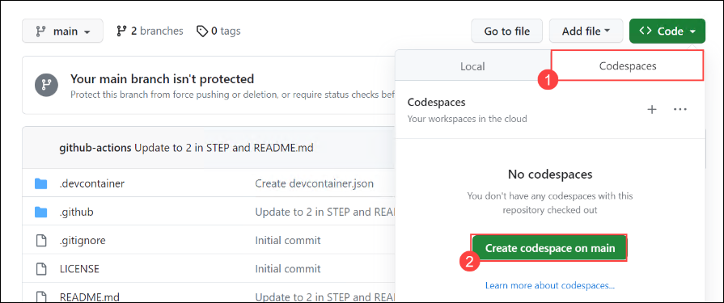

1. You will encounter a pop-up prompt. Click **Open** to proceed. Subsequently, another pop-up window will appear within Visual Studio Code (VS Code), where you should once again select **Install and Open** to continue.

   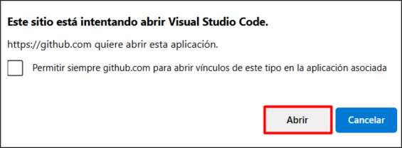

   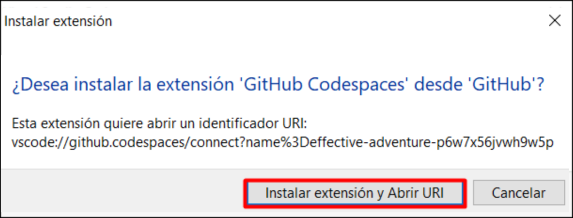

1. At the bottom right corner, you will get a prompt to sign in to GitHub.

1. Next, once you get the popup, click on **Allow**

   >**Note**: Wait about 2 minutes for the codespace to spin itself up.

   

1. Click **Authorize Visual-Studio-Code** once the Authorize GitHub for VS code tab appears in the browser.

1. Verify your codespace is running.

1. You can now edit your GitHub repository files, commit and push the changes directly to GitHub through VS Code.

## Task 4: Explore GitHub Copilot Features

In this task, you'll explore on various GitHub Copilot features through a simple Python script that defines a function to calculate the factorial of a number.

1. Below is a simple Python script that defines a function to calculate the factorial of a number. Let's use this to explore the GitHub Copilot features.

   ```
   def factorial(n):
       if n == 0:
           return 1
       else:
           return n * factorial(n-1)

   choice = int(input("Enter a number to calculate its factorial: "))
   print(f"The factorial of {choice} is {factorial(choice)}")
   ```

1. Select the entire code, right click and view the **Copilot** features.

   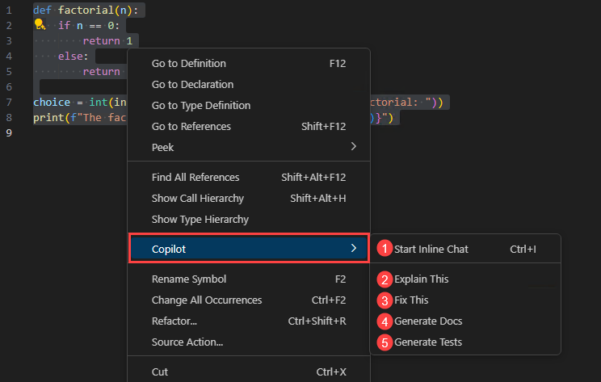

1. **Start Inline Chat (1)** feature allows you to ask questions or provide feedback directly within your code editor while using the GitHub Copilot.

1. **Explain This (2)** feature gives a detailed explanation of how the code works and it's functionality.

   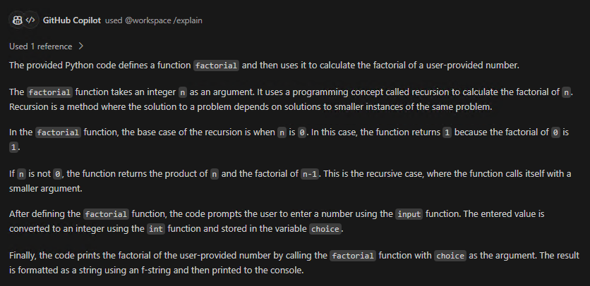

1. **Fix This (3)** feature proposes a fix for the problems in the selected code.

   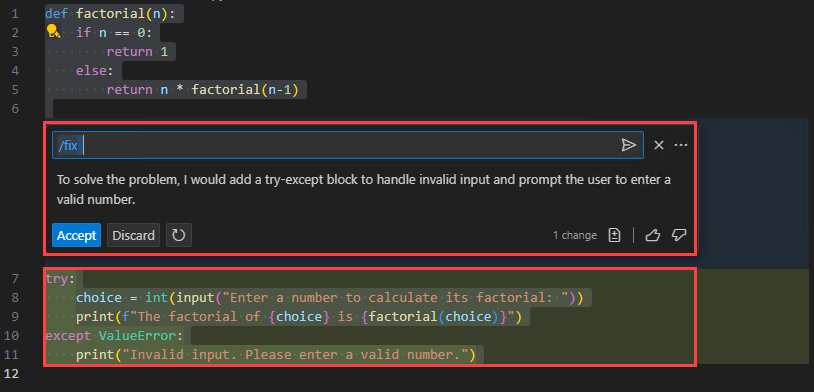

1. **Generate Docs (4)** feature generates documentation or comments about the selected code.

   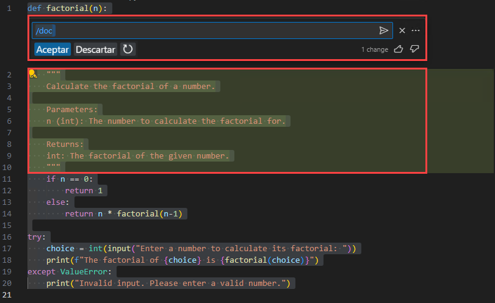

1. **Generate Tests (5)** feature generates unit tests for the selected code. In this case, the GitHub Copilot generates a test cases Python script after which you can execute the script and view the results.

   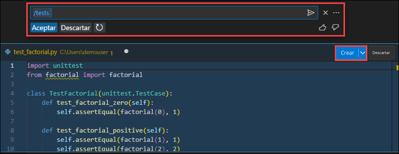

   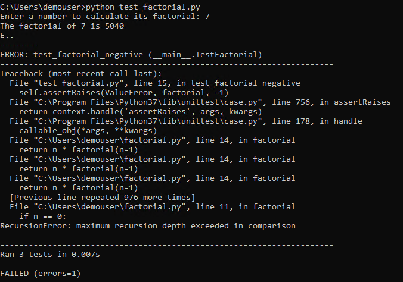

1. You can also ask how to do something in terminal, ask about VS Code and ask about your workspace simply by entering **@** special character in your GitHub Copilot Chat window.

   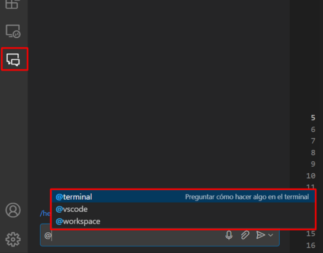

1. GitHub Copilot also assists you in scaffolding code for a new workspace, generate a new Jupyter notebook and various types of documentations like Markdown and Javadoc.

## Task 5: Code Generation with Copilot and Copilot Chat

In this task, you'll create a Python/JS code to build a calculator and use OpenWeatherMap API keys to get the weather data from weather APIs.

1. Open GitHub Copilot chat window and ask GitHub Copilot to create a Python/JS code to build a calculator.

   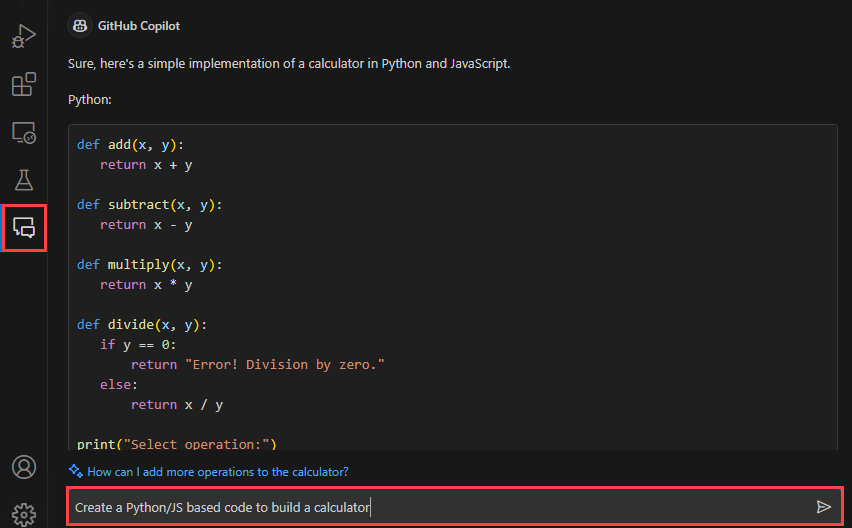

1. Notice how GitHub Copilot creates codes to build a calculator in both Python and JS languages. Save the files to run tests.

   - Python code to build a calculator:
     ```
     def add(x, y):
         return x + y

     def subtract(x, y):
         return x - y

     def multiply(x, y):
         return x * y

     def divide(x, y):
         if y == 0:
             return "Error! Division by zero."
         else:
             return x / y

     print("Select operation:")
     print("1.Add")
     print("2.Subtract")
     print("3.Multiply")
     print("4.Divide")

     while True:
         choice = input("Enter choice(1/2/3/4): ")

         if choice in ('1', '2', '3', '4'):
             num1 = float(input("Enter first number: "))
             num2 = float(input("Enter second number: "))

              if choice == '1':
                 print(num1, "+", num2, "=", add(num1, num2))

             elif choice == '2':
                 print(num1, "-", num2, "=", subtract(num1, num2))

             elif choice == '3':
                 print(num1, "*", num2, "=", multiply(num1, num2))

             elif choice == '4':
                 print(num1, "/", num2, "=", divide(num1, num2))
             break
         else:
     print("Invalid Input")
     ```

   - JS code to build a calculator
     ```
      // Function to add two numbers
      function add(a, b) {
        return a + b;
      }

      // Function to subtract two numbers
      function subtract(a, b) {
        return a - b;
      }

      // Function to multiply two numbers
      function multiply(a, b) {
        return a * b;
      }

      // Function to divide two numbers
      function divide(a, b) {
        if (b === 0) {
          return "Error: Division by zero";
        }
        return a / b;
      }

      // Declare and assign values to num1 and num2
      var num1 = 5;
      var num2 = 3;

      console.log("Addition:", add(num1, num2));
      console.log("Subtraction:", subtract(num1, num2));
      console.log("Multiplication:", multiply(num1, num2));
      console.log("Division:", divide(num1, num2));
     ```
   > **Note:** Declare the two variables/numbers before running tests through JS.

1. Run tests for the files by experimenting with different operations to verify the working of the calculator.

1. To get the weather data from weather APIs, first sign in to the OpenWeatherMap API website (https://openweathermap.org/) and on the dropdown of your user profile in the top right, click **My API keys**. You can either use the default API key or create a new one for to get the weather data using code.

   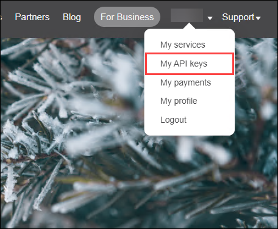

1. Open GitHub Copilot chat window and ask GitHub Copilot to create a Python/JS based app to get weather data from weather APIs.

   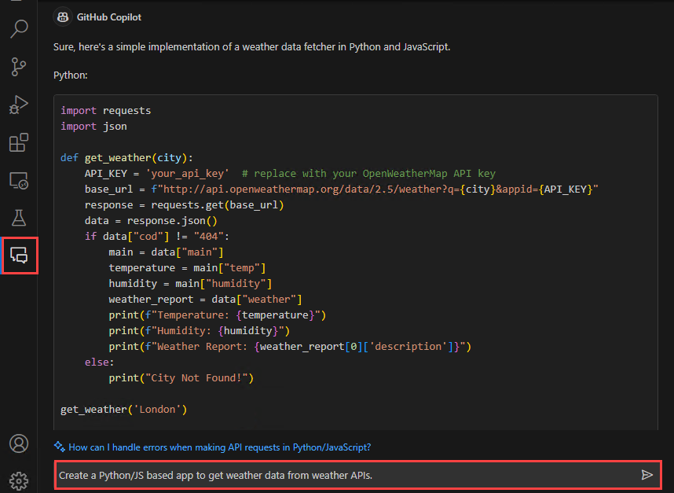

1. Notice how GitHub Copilot creates codes to get weather data from weather APIs in both Python and JS languages.

   - Python:
     ```
     import requests

     def get_weather(city):
       API_KEY = 'ENTER YOUR WEATHER API KEY HERE'
       BASE_URL = f"http://api.openweathermap.org/data/2.5/weather?q={city}&appid={API_KEY}"
       response = requests.get(BASE_URL)
       data = response.json()
       main = data['main']
       print(f"Temperature: {main['temp']}")
       print(f"Humidity: {main['humidity']}")
       print(f"Weather: {data['weather'][0]['description']}")

     city = input("Enter the city: ")
     get_weather(city)
     ```
   - JS:
     ```
     async function getWeather(city) {
        const API_KEY = 'ENTER YOUR WEATHER API KEY HERE';
        const BASE_URL = `http://api.openweathermap.org/data/2.5/weather?q=${city}&appid=${API_KEY}`;
        const response = await fetch(BASE_URL);
        const data = await response.json();
        console.log(`Temperature: ${data.main.temp}`);
        console.log(`Humidity: ${data.main.humidity}`);
        console.log(`Weather: ${data.weather[0].description}`);
     }

     const city = 'Mumbai';  // Replace with the city you want to get the weather for
     getWeather(city);
     ```
   > **Note:** Enter the name of the city before running tests through JS.

1. Run tests for the files by entering different cities to verify that the weather data is being fetched from the weather APIs.

## Task 6: Code Refactoring & Debugging

In this task, you'll be refactoring and debugging the poorly written Python codes using GitHub Copilot and test out a few scenarios.

1. Copy the below code in a new file in VS Code.

   ```
   #A poorly written example of a program in Python. It prompts the user for the number of elements to sum, takes those integers as input, and handles some basic error cases
      
   MAX = 100

   def calculate_sum(arr):
         result = 0
         for num in arr:
            result += num
         return result

   def main():
         try:
            n = int(input("Enter the number of elements (1-100): "))
            if not 1 <= n <= MAX:
                  print("Invalid input. Please provide a digit ranging from 1 to 100.")
                  exit(1)

            arr = []

            print(f"Enter {n} integers:")
            for _ in range(n):
                  try:
                     arr.append(int(input()))
                  except ValueError:
                     print("Invalid input. Please enter valid integers.")
                     exit(1)

            total = calculate_sum(arr)

            print("Sum of the numbers:", total)

         except KeyboardInterrupt:
            print("\nProgram terminated by user.")
            exit(1)

   if __name__ == "__main__":
         main()
   ```
1. Select the entire code, right click and click **Refactor** using Copilot and ask the Copilot to refactor the selected code.

1. You'll notice that GitHub Copilot has refactored and fixed the code.

   ```
   #A poorly written example of a program in Python. It prompts the user for the number of elements to sum, takes those integers as input, and handles some basic error cases

   MAX = 100

   def calculate_sum(arr):
      return sum(arr)

   def main():
      try:
         n = int(input("Enter the number of elements (1-100): "))
         if not 1 <= n <= MAX:
            print("Invalid input. Please provide a digit ranging from 1 to 100.")
            exit(1)

         arr = []

         print(f"Enter {n} integers:")
         for _ in range(n):
            try:
               arr.append(int(input()))
            except ValueError:
               print("Invalid input. Please enter valid integers.")
               exit(1)

         total = calculate_sum(arr)

         print("Sum of the numbers:", total)

      except KeyboardInterrupt:
         print("\nProgram terminated by user.")
         exit(1)

   if __name__ == "__main__":
      main()
   ```

1. Save the file and run a few test cases to verify that the code refactored by GitHub Copilot is accurate.

1. Copy the below code in a new file in VS Code.

   ```
   # Intentionally flawed Python program

   # importing modules
   import itertools, random

   # make a deck of cards
   deck = list(itertools.product(range(1,14),['Spade','Heart','Diamond','Club'])

   # shuffle the cards
   random.shuffle(deck)

   # draw five cards
   print("You got:")
   for i in range(5)
      print(deck[i][0], "of", deck[i][1]
   ```

1. Select the entire code, right click and click **Copilot** and then click **Fix This** to debug the selected code.

1. You'll notice that GitHub Copilot has debugged and fixed the code.

   ```
   # Intentionally flawed Python program

   # importing modules
   import itertools
   import random

   # make a deck of cards
   deck = list(itertools.product(range(1, 14), ['Spade', 'Heart', 'Diamond', 'Club']))

   # shuffle the cards
   random.shuffle(deck)

   # draw five cards
   print("You got:")
   for i in range(5):
      print(deck[i][0], "of", deck[i][1])
   ```

1. Save the file and run a few test cases to verify that the code debugged by GitHub Copilot is working as expected.

