# Challenge 2: Develop an App with GitHub Copilot - Solution Guide

## Task 1: Develop an App

### Login to GitHub

- Login to [GitHub](https://github.com/login) with the CloudLabs provided GitHub account. Ensure that you are logged in to the correct GitHub account provided for this lab session.

### Fork the Repository

- Navigate to the provided GitHub repository link: [CloudLabs-CRUD-application](https://github.com/CloudLabsAI-Azure/CloudLabs-CRUD-application).

    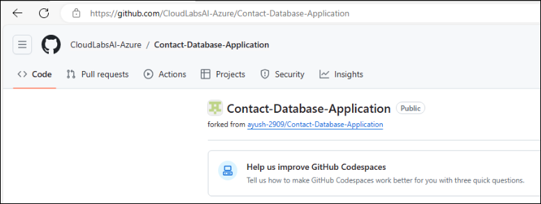

- Fork the repository into the CloudLabs provided GitHub account.

    

### Open Visual Studio and Clone Repository

- Launch Visual Studio and login using the CloudLabs provided GitHub account credentials.

    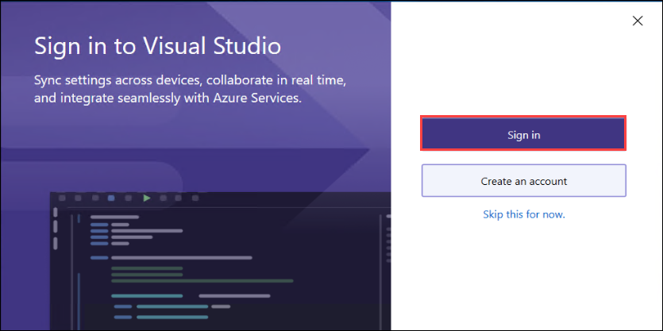

- Clone the forked repository by clicking on "Clone a repository".

    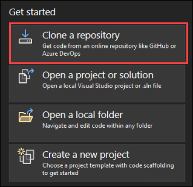

- Then, select "GitHub" under Browse a repository.

    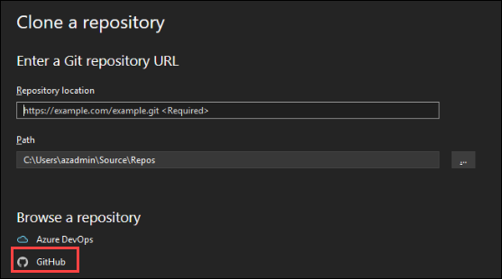

- Choose the repository you forked earlier and click on "Clone".

    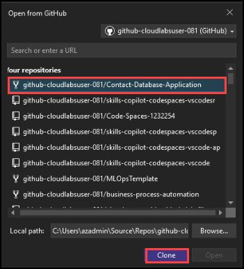

### Navigate to Project Files

- Once the repository is cloned, locate and open the `Contact Database application.sln` file from the Solution Explorer.

    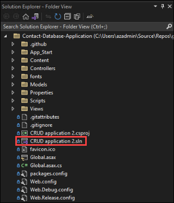

- Navigate to Tools on the top panel of Visual Studio. Then click on "Nuget Package Manager", and then click on "Package Manager Console".

    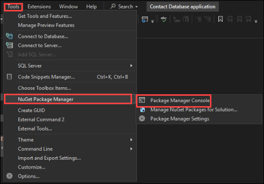

- Run the below command on the console.

    ```
    Update-Package Microsoft.CodeDom.Providers.DotNetCompilerPlatform -r
    ```

    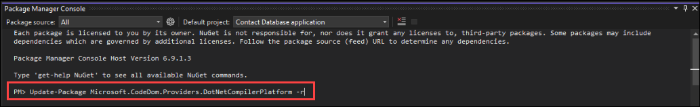

### Implement Methods using GitHub Copilot

- Navigate to the `UserController.cs` file within the `Controllers` folder.

    

- Use GitHub Copilot to generate code for each empty method in the `UserController.cs` file. To generate code for each empty method using GitHub Copilot, Select or highlight the lines of the empty method, and then right-click on the highlighted lines to open the context menu. 

    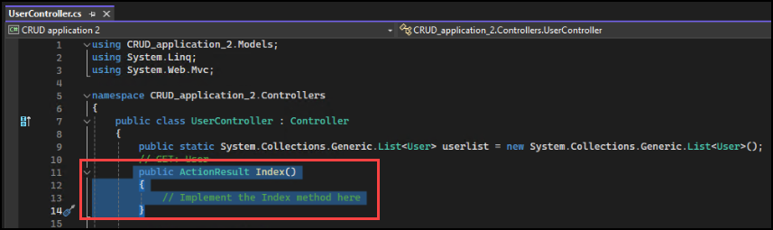
    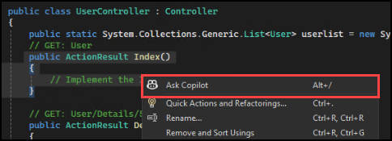

- From the context menu, choose the "Ask Copilot" option. In the prompt box, type "Fill in the Index method"

    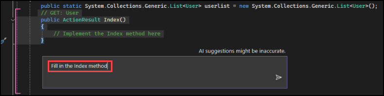

- GitHub Copilot will generate a code suggestion based on the context of the method. Review the suggestion provided by GitHub Copilot, and you can choose to accept or discard the suggestion based on its relevance to your requirements.

    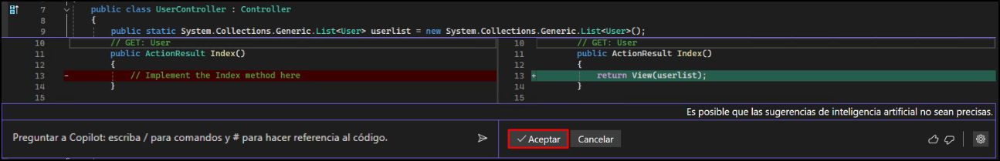

- Repeat this process for each empty method in the UserController.cs file until all methods are implemented.

- Following these steps will allow you to efficiently utilize GitHub Copilot to generate code for each empty method in the UserController.cs file.

### Run and test the Application

- Locate the IIS Express button (a green play button) in the toolbar and click on it. This action starts the application on localhost in a web browser.

    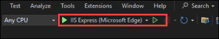

### Create a New Contact

- In the opened web browser, locate the "Create New" button and click on it.

    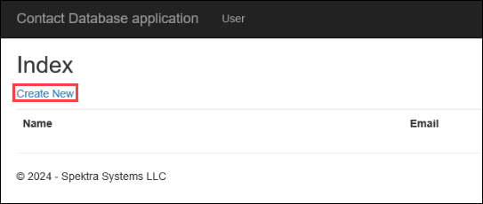

- Fill in the required fields for Name and Email in the form provided. Click on the "Create" button to submit the form and create a new contact.

    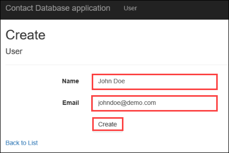

### Edit a Contact

- After creating a contact, return to the homepage.

- Find the contact you created in the list and locate the "Edit" button associated with it. Click on the "Edit" button.

    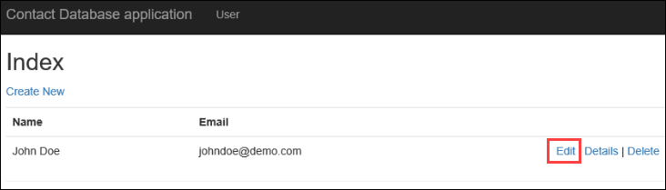

- Modify the existing details (Name or Email) as desired. Save the changes by clicking on the "Save" button.

    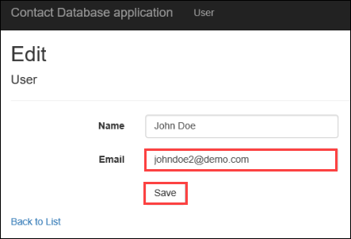

### Verify Details of a Contact

- Once again, return to the homepage.

- Locate the contact whose details you want to verify. Click on the "Details" button associated with that contact.

    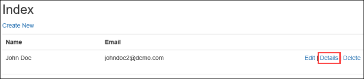

- Verify that the displayed details match the information you entered earlier.

    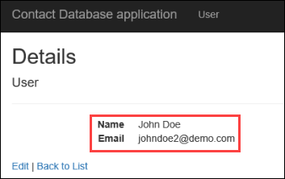

### Delete a Contact

- From the homepage, find the contact you wish to delete.

- Click on the "Delete" button associated with that contact.

    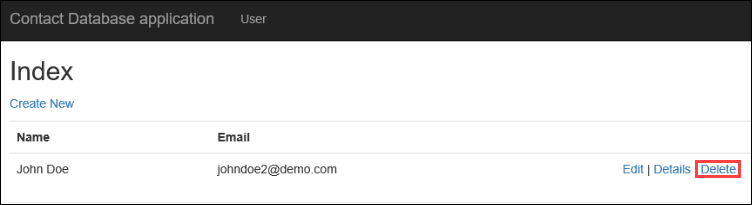

- A confirmation dialog will appear asking if you're sure you want to delete the contact. Confirm the action.

    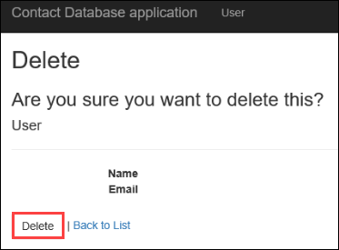

- Ensure that the contact is removed from the list after deletion.

    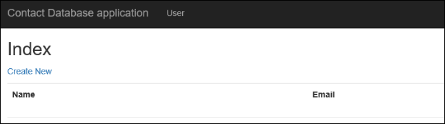

By following these steps meticulously, you can thoroughly test the CRUD (Create, Read, Update, Delete) functionalities of the application and ensure its proper functioning.

# Task 2: Generate Unit Test Cases

- To generate unit test cases, we need to add a new project. In the solution explorer, right-click on the Solution.

    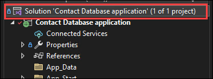

- Click on Add, and then click on New Project.

    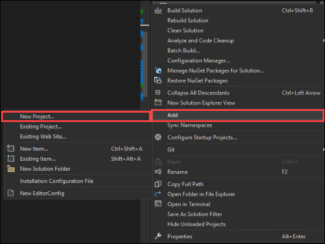

- Now search for Unit test in the search box select the Unit Test Project (.Net Framework) and then click on Next.

    

- Name the project Usercontrollertest and then click on Create.

    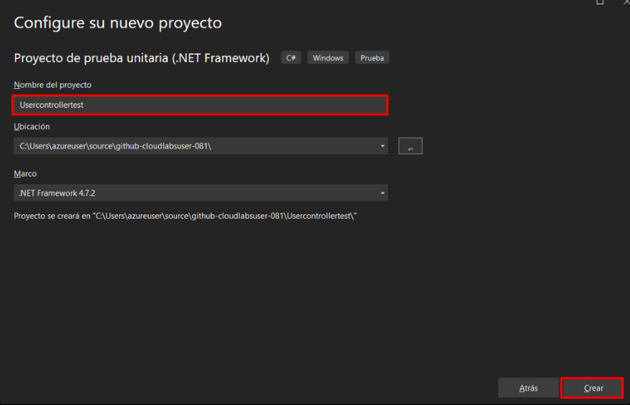

- Rename the UnitTest1.cs file to UserControllerTests.cs.

- Now let's ask Github Copilot Chat to generate test cases. Click on the "View" option on the top panel of Visual Studio. From the options, select "GitHub Copilot Chat" to open the GitHub Copilot Chat window.

    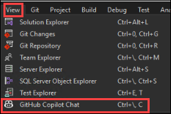

- Open the UserController.cs file and select/highlight the entire code in it.

    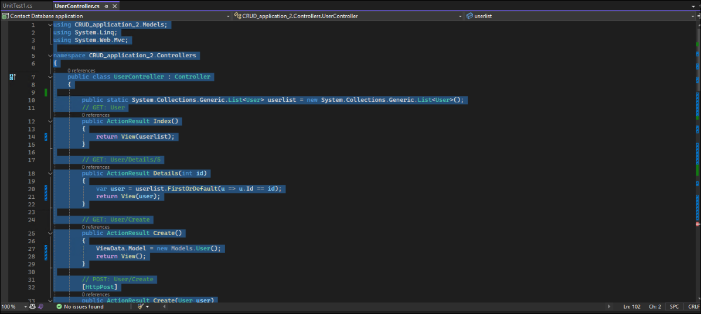

- Once the entire code is highlighted, in the Github Copilot Chat, provide a prompt as "generate unit test cases for usercontroller.cs"

    

- Github Copilot will start generating unit test cases for the usercontroller.cs.

    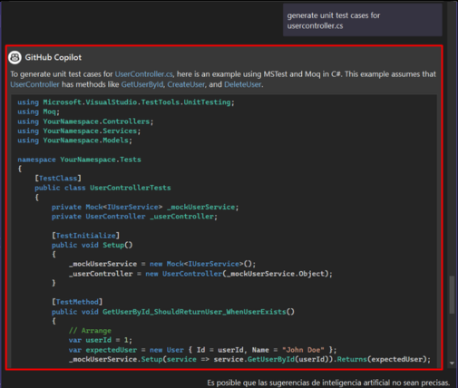

- Now copy the code provided by Github Copilot by clicking on the copy icon.

    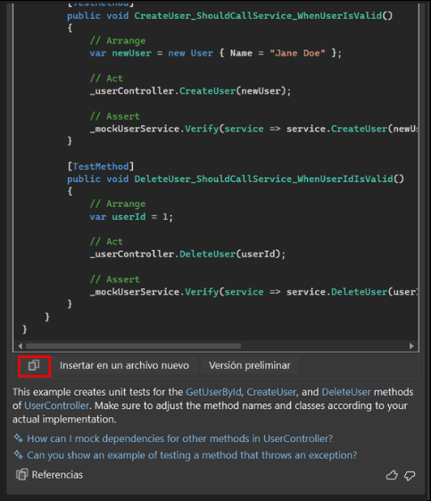

- Remove the existing code and paste the code that we copied into the file.

    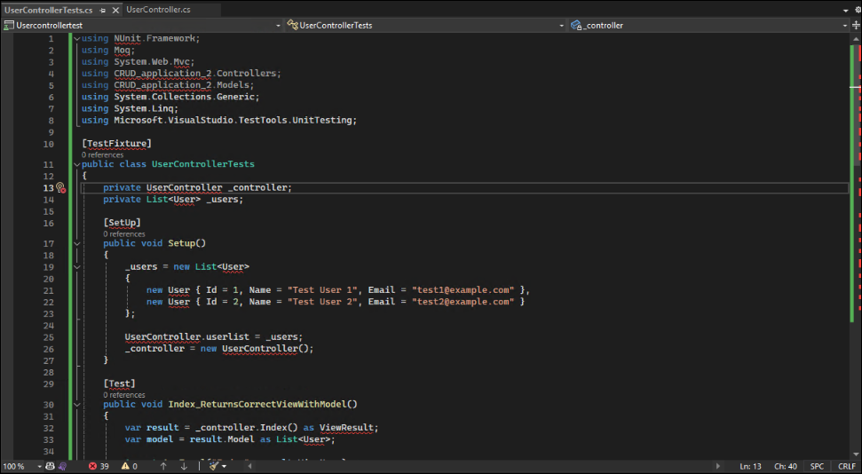

- Let us now add references to the project. Locate the References for UserControllertest and then right-click on it. Then click on Add Reference.

    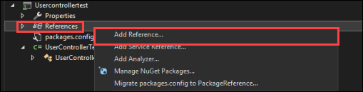

- Now in the Projects, check the check box, and then click on OK.

    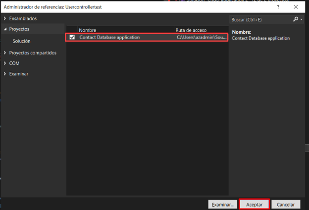

- Now let's fix the issues in the file by hovering the cursor at the Test Fixture and then clicking Show potential fixes.

    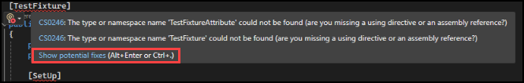

- Click on "Install package NUnit" and then click on "Find and install latest version".

    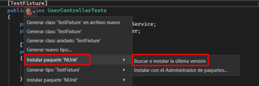

- Similarly, hover the cursor on the controller.Index() click on Show potential fixes, and then click on "Install package 'Microsoft.ASPNet.Mvc'" and then click on "Use Local version '5.2.7'"

    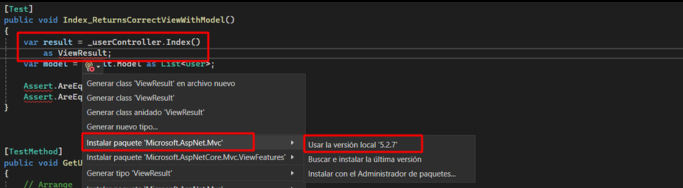

- Again, for the RouteValues, hover the cursor and then click on show potential fixes, and then click on Add reference.

    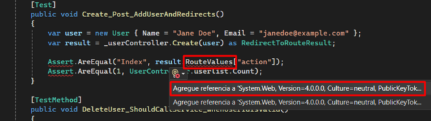

- Again, for the Assert, hover the cursor and then click on show potential fixes and then click on ussing Assert.

    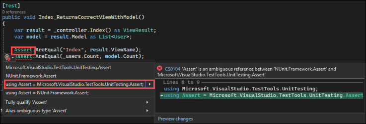

- After resolving all the issues in the file, you click on the Test option on the top panel of Visual Studio. Then click on Test Explorer. 

    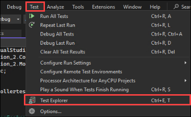

- In the Test Explorer, click on the Run All button to run the test cases.

    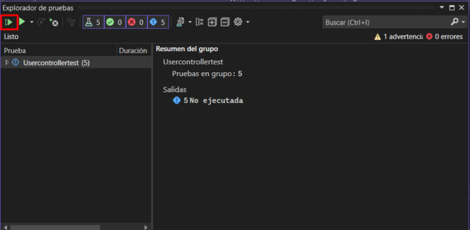

- Verify that all the test cases have passed.

    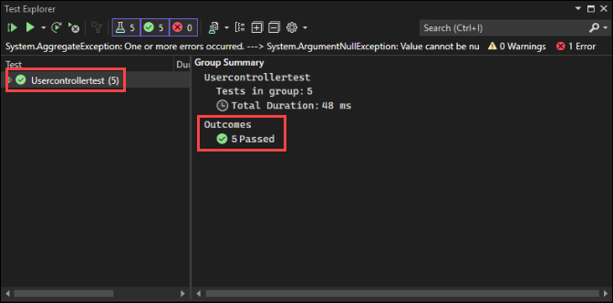

# Task 3: Develop and Test Features

### Utilize GitHub Copilot Chat for Feature Development:
  
   - Click on the "View" option on the top panel of Visual Studio. From the options, select "GitHub Copilot Chat" to open the GitHub Copilot Chat window.
  
        

### Ask GitHub Copilot Chat for Feature Implementation:
   
   - Initiate a conversation with GitHub Copilot Chat by asking, "How can we add a search feature/functionality to our application?"

        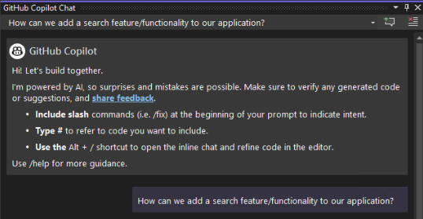

   - Based on the response generated by GitHub Copilot, proceed with implementing the suggested code.
  
   - In this case, GitHub Copilot suggested adding a new method to accept a search string as a parameter and filter the user list based on the search string before passing it to the view.

        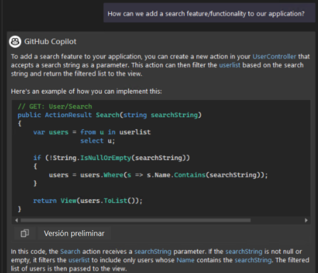
  
   - Copy and paste the provided code snippet into the `UserController.cs` file within the appropriate action method, typically the `Index` method. In this code, if a searchString is provided, the user list is filtered to only include users whose names contain the searchString. If no searchString is provided, all users are returned.

        ```
        // GET: User
        public ActionResult Index(string searchString)
        {
            var users = from u in userlist
                        select u;
            if (!String.IsNullOrEmpty(searchString))
            {
                users = users.Where(s => s.Name.Contains(searchString));
            }
            return View(users.ToList());
        }
        ```

        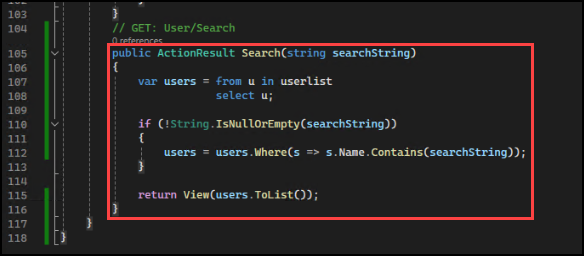

   - GitHub Copilot also suggested modifying the `Index.cshtml` file located in the path **Views\User\Index.cshtml** to include a form for the search string.

        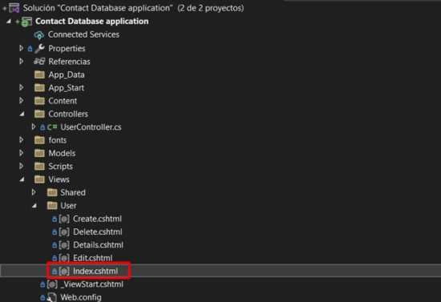

   - Copy and paste the provided code snippet into the `Index.cshtml` file. This form sends a GET request to the Index action method, passing the search string as a query string parameter.

        ```
        @using (Html.BeginForm("Index", "User", FormMethod.Get))
        {
            <p>
                Find by name: @Html.TextBox("searchString") 
                <input type="submit" value="Search" />
            </p>
        }
        ```

        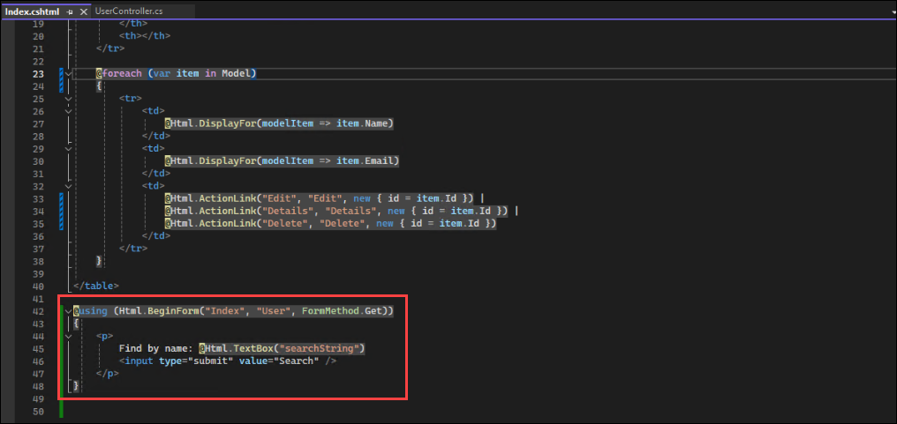

### Save Changes and Run the Application:

   - Save both the `UserController.cs` and `Index.cshtml` files after making the necessary changes.

   - Run the application by clicking on the IIS Express button. This action starts the application on localhost in a web browser.

        

### Test the Search Functionality:

   - Add a couple of contact entries to the application by clicking on the "Create New" button and filling in the Name and Email fields.

        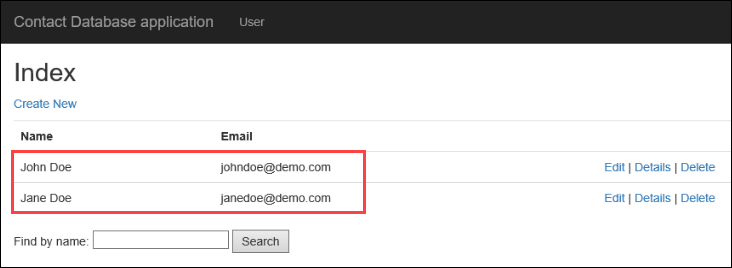

   - Once contacts are added, test the search functionality by typing a contact name in the search field that was previously added. Click on the "Search" button to execute the search.

        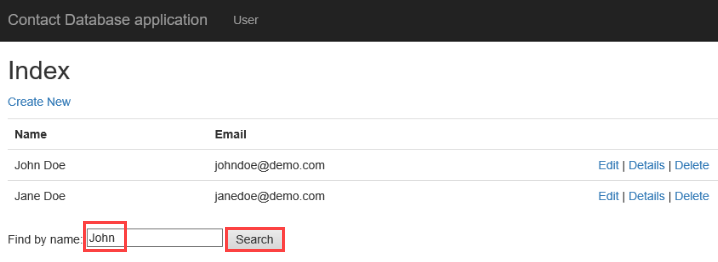

   - If the feature was implemented properly, you should be able to see the searched contact in the results.

        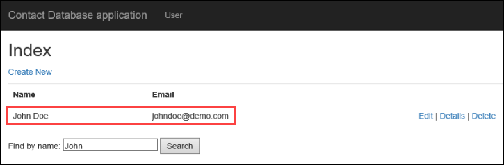

By following these steps, you can effectively utilize GitHub Copilot to implement and test new features in your application, enhancing its functionality and usability.

# Task 4: Generating Commit Messages

The new Generated Commit Message feature uses GitHub Copilot AI to describe your code changes.  This makes writing descriptive and helpful commit messages as easy as clicking a button, and then adding your explanation.

- Locate the Git Changes and click on it.

    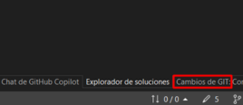

- Use the new “Add AI Generated Commit Message” sparkle pen icon in the Git Changes window to generate a suggestion.

    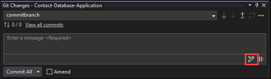

- GitHub Copilot will look at the file changes in your commit, summarize them, and then describe each change. You can then “Insert AI Suggestion” or “Discard.” Click on Commit All.

    

- Once it is committed locally, click on Push to push the changes into the repository.

    
