# Challenge 3: Deploy the App to Azure - Solution Guide

## Task 1: Develop ARM Template to deploy an app to Azure

In this task you'll be generating an ARM template to deploy a web application to Azure using Azure App Services and define the necessary resources.

1. In your GitHub Copilot Chat window, ask the GitHub Copilot to generate an ARM template to deploy a web app with necessary resources defined (basic/free pricing plan, basic authentication enabled and GitHub actions setting disabled).

   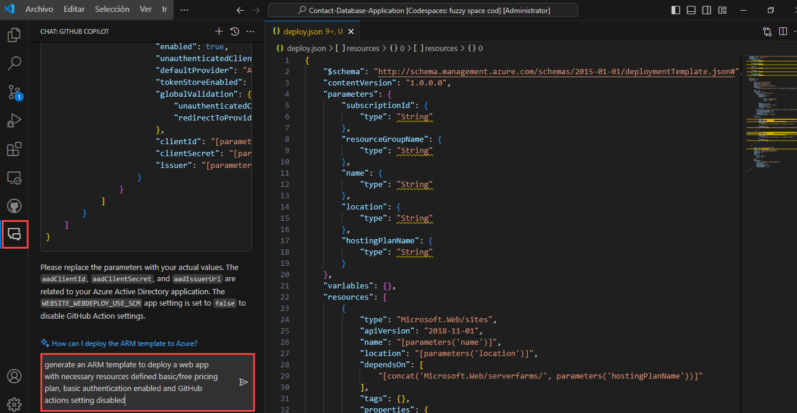

1. GitHub Copilt will generate a basic ARM template (which might be not accurate). Copy and paste the ARM template in a new file named **deploy.json**, utilize GitHub Copilot Suggestions and Chat to refactor the template to your specifications. Your ARM template must resemble as given below wth the resources and specifications.

   ```
   {
    "$schema": "http://schema.management.azure.com/schemas/2015-01-01/deploymentTemplate.json#",
    "contentVersion": "1.0.0.0",
    "parameters": {
        "subscriptionId": {
            "type": "String"
        },
        "resourceGroupName": {
            "type": "String"
        },
        "name": {
            "type": "String"
        },
        "location": {
            "type": "String"
        },
        "hostingPlanName": {
            "type": "String"
        }
    },
    "variables": {},
    "resources": [
        {
            "type": "Microsoft.Web/sites",
            "apiVersion": "2018-11-01",
            "name": "[parameters('name')]",
            "location": "[parameters('location')]",
            "dependsOn": [
                "[concat('Microsoft.Web/serverfarms/', parameters('hostingPlanName'))]"
            ],
            "tags": {},
            "properties": {
                "name": "[parameters('name')]",
                "siteConfig": {
                    "appSettings": [],
                    "metadata": [
                        {
                            "name": "CURRENT_STACK",
                            "value": "dotnet"
                        }
                    ],
                    "phpVersion": "OFF",
                    "netFrameworkVersion": "v4.0",
                    "alwaysOn": false,
                    "ftpsState": "FtpsOnly"
                },
                "serverFarmId": "[concat('/subscriptions/', parameters('subscriptionId'),'/resourcegroups/', parameters('resourceGroupName'), '/providers/Microsoft.Web/serverfarms/', parameters('hostingPlanName'))]",
                "clientAffinityEnabled": true,
                "virtualNetworkSubnetId": null,
                "httpsOnly": true,
                "publicNetworkAccess": "Enabled"
            },
            "resources": [
                {
                    "type": "Microsoft.Web/sites/basicPublishingCredentialsPolicies",
                    "apiVersion": "2022-09-01",
                    "name": "[concat(parameters('name'), '/scm')]",
                    "dependsOn": [
                        "[resourceId('Microsoft.Web/Sites', parameters('name'))]"
                    ],
                    "properties": {
                        "allow": true
                    }
                },
                {
                    "type": "Microsoft.Web/sites/basicPublishingCredentialsPolicies",
                    "apiVersion": "2022-09-01",
                    "name": "[concat(parameters('name'), '/ftp')]",
                    "dependsOn": [
                        "[resourceId('Microsoft.Web/Sites', parameters('name'))]"
                    ],
                    "properties": {
                        "allow": true
                    }
                }
            ]
        },
        {
            "type": "Microsoft.Web/serverfarms",
            "apiVersion": "2018-11-01",
            "name": "[parameters('hostingPlanName')]",
            "location": "[parameters('location')]",
            "dependsOn": [],
            "tags": {},
            "sku": {
                "Tier": "Basic",
                "Name": "B1"
            },
            "kind": "",
            "properties": {
                "name": "[parameters('hostingPlanName')]",
                "workerSize": "0",
                "workerSizeId": "0",
                "numberOfWorkers": "1",
                "zoneRedundant": false
            }
         }
      ] 
   }
   ```

1. In your VS Code, create a new file **deploy.parameters.json** to define the parameters from your *deploy.json* file.

   ```
   {
    "$schema": "https://schema.management.azure.com/schemas/2015-01-01/deploymentParameters.json#",
    "contentVersion": "1.0.0.0",
    "parameters": {
        "subscriptionId": {
            "type": "String"
        },
        "resourceGroupName": {
            "type": "String"
        },
        "name": {
            "type": "String"
        },
        "location": {
            "type": "String"
        },
        "hostingPlanName": {
            "type": "String"
        }
     }
   }
   ```

1. In your Azure portal, search for **Deploy a custom template** service. You will use this Azure service to deploy your custom ARM template.

   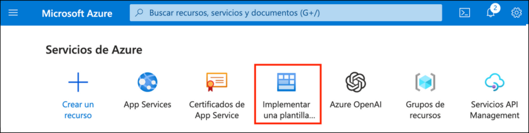

1. In your Custom deployment tab, click on **Build your own template in editor**.

   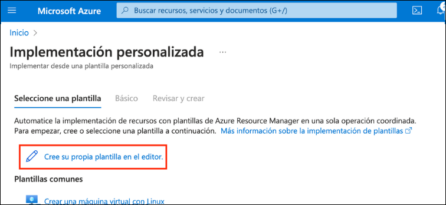

1. In your Edit Template tab, delete the existing skeleton ARM template, copy & paste the newly generate ARM template using GitHub Copilot and click **Save**.

   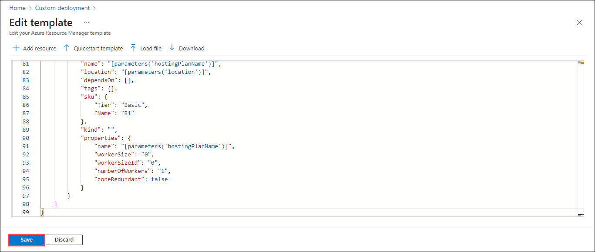

1. Enter the specifications to deploy your web app. Make sure to deploy the web app in the existing resource group named **GitHub-Copilot-Challenges**.

1. Once you have specified all the parameters, click **Review and Create** and **Create**.

1. Wait for the deployment to succeed and verify that your web app service and app service plan resources exist in the resource group.

   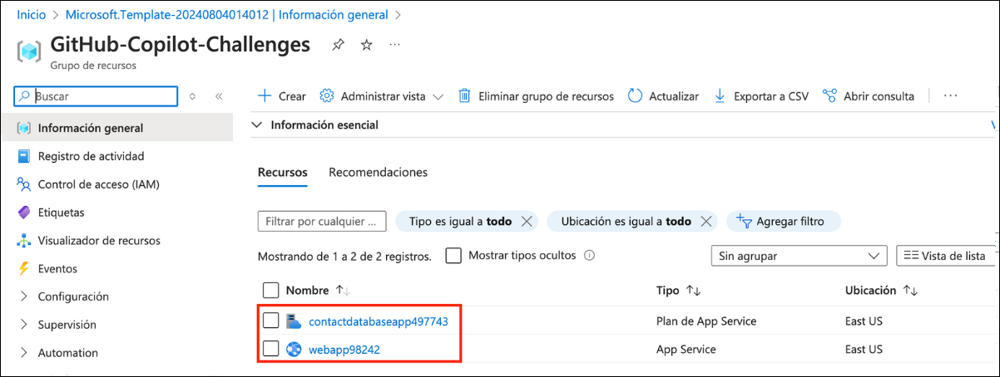

## Task 2: Generate GitHub Action Workflow using Deployment Center from Web App in Azure portal

In this task, you'll generate a GitHub Action workflow pipeline using Deployment Center from Web App in Azure portal.

1. Navigate to your web app service, under the **Deployment** settings, select **Deployment Center**.

   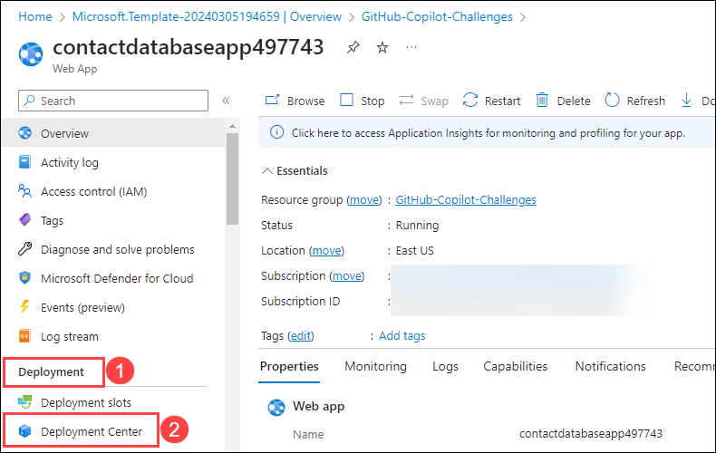

1. Specify the following settings to generate a GitHub Action workflow YAML file and click **Save**:

   * **Source**: GitHub
   * **Signed in as**: Your GitHub Account
   * **Organization**: Your Github Organization
   * **Repository**: Your Github Repository (**Contact Database Application**)
   * **Branch**: Your GitHub Repository Branch
   * **Authentication type**: Basic authentication
  
   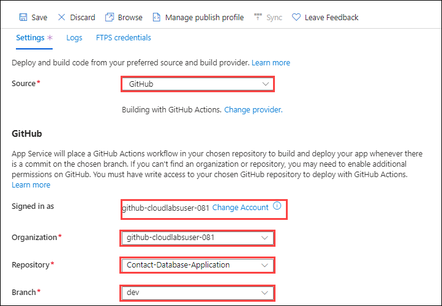

   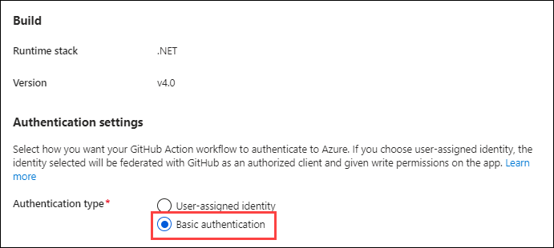

1. You can also view your workflow configuration by clicking on the **Preview file** button.

1. Navigate to your GitHub repository and under **Actions** tab, you'll notice that the build has started for your web app. Wait for GitHub action workflow build and deploy to succeed

   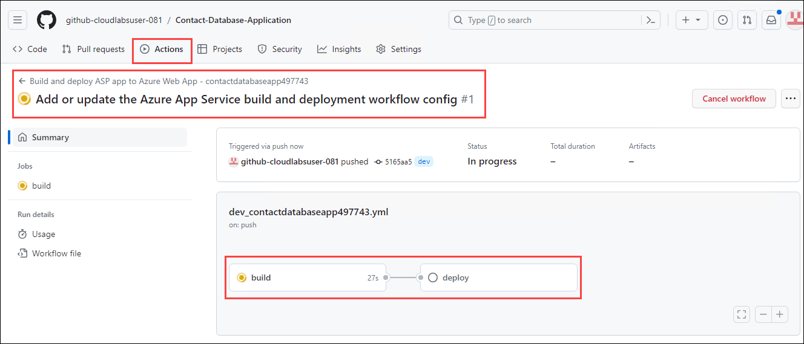


## Task 3: Get the app working on Azure

In this task, you'll verify that the GitHub action pipeline build is succeeded, the workflow file is created and if your  web app is working as expected on Azure.

1. In your GitHub repository Actions setting, verify that the pipeline build of both the jobs succeeded **(1)**.

   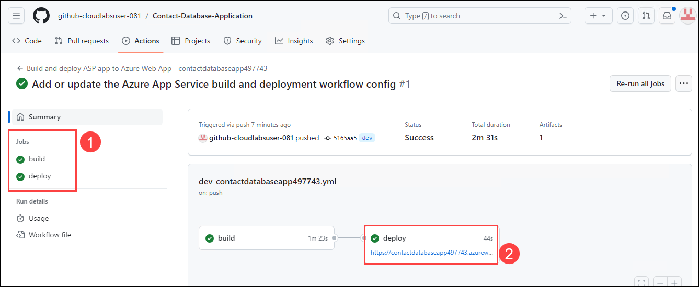

1. Verify that your web app is working as expected by navigating to the web application **(2)** in a different tab.

   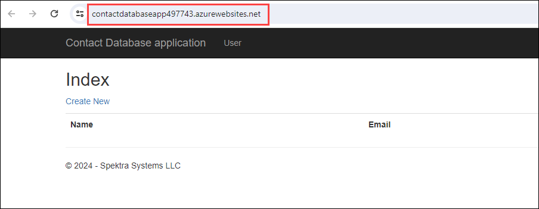

1. Also verify that your workflow file has been created in a new directory **.github/workflows**.

   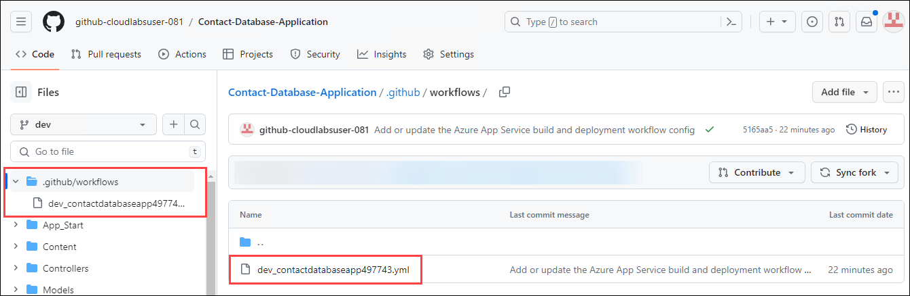

1. Your GitHub workflow file will be in the below format:

   ```
   # Docs for the Azure Web Apps Deploy action: https://github.com/Azure/webapps-deploy
   # More GitHub Actions for Azure: https://github.com/Azure/actions

   name: Build and deploy ASP app to Azure Web App - contactdatabaseapp497743

   on:
     push:
       branches:
         - dev
     workflow_dispatch:

   jobs:
     build:
       runs-on: windows-latest

       steps:
         - uses: actions/checkout@v4

         - name: Setup MSBuild path
           uses: microsoft/setup-msbuild@v1.0.2

         - name: Setup NuGet
           uses: NuGet/setup-nuget@v1.0.5

         - name: Restore NuGet packages
           run: nuget restore

         - name: Publish to folder
           run: msbuild /nologo /verbosity:m /t:Build /t:pipelinePreDeployCopyAllFilesToOneFolder /p:_PackageTempDir="\published\"
   
         - name: Upload artifact for deployment job
           uses: actions/upload-artifact@v3
           with:
             name: ASP-app
             path: '/published/**'

     deploy:
       runs-on: windows-latest
       needs: build
       environment:
         name: 'Production'
         url: ${{ steps.deploy-to-webapp.outputs.webapp-url }}
    
       steps:
         - name: Download artifact from build job
           uses: actions/download-artifact@v3
           with:
             name: ASP-app
      
         - name: Deploy to Azure Web App
           id: deploy-to-webapp
           uses: azure/webapps-deploy@v2
           with:
             app-name: 'contactdatabaseapp497743'
             slot-name: 'Production'
             package: .
             publish-profile: ${{ secrets.AZUREAPPSERVICE_PUBLISHPROFILE_9F0403D6030744CF902D4FDC5870C440 }}
   ```

1. You can also verify the working of your web app by navigating to the Azure portal, App Service, in the Overview setting and clicking on the **Default Domain**.

   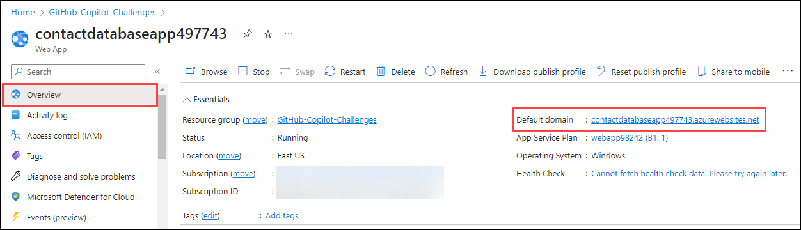


