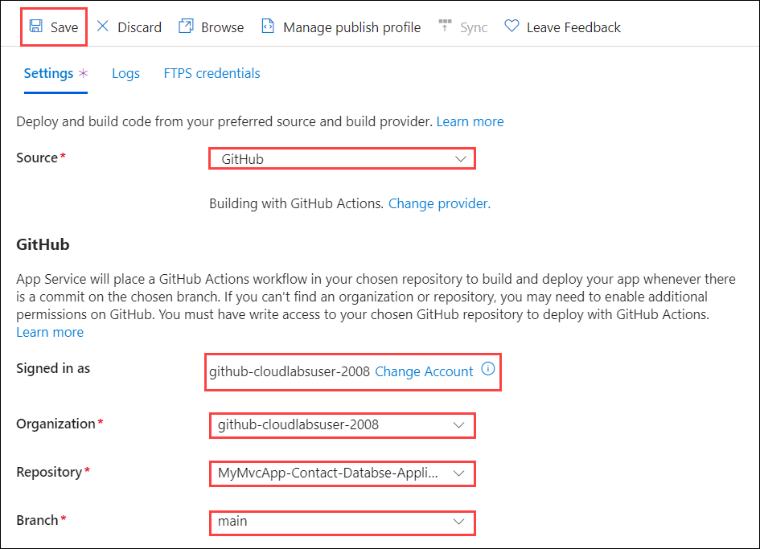
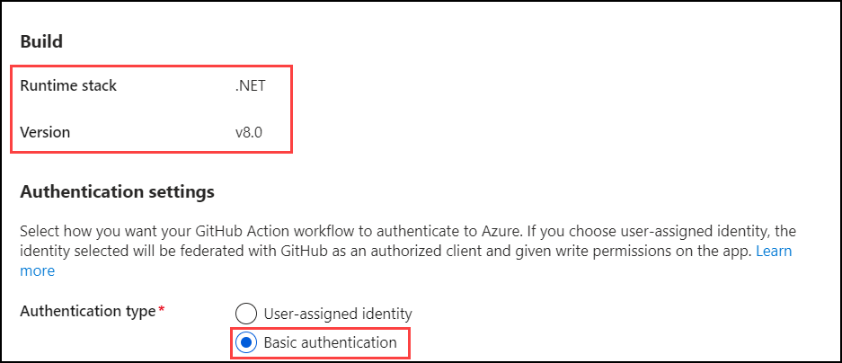
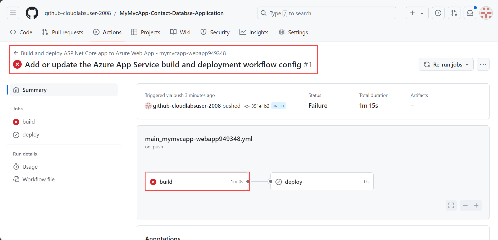
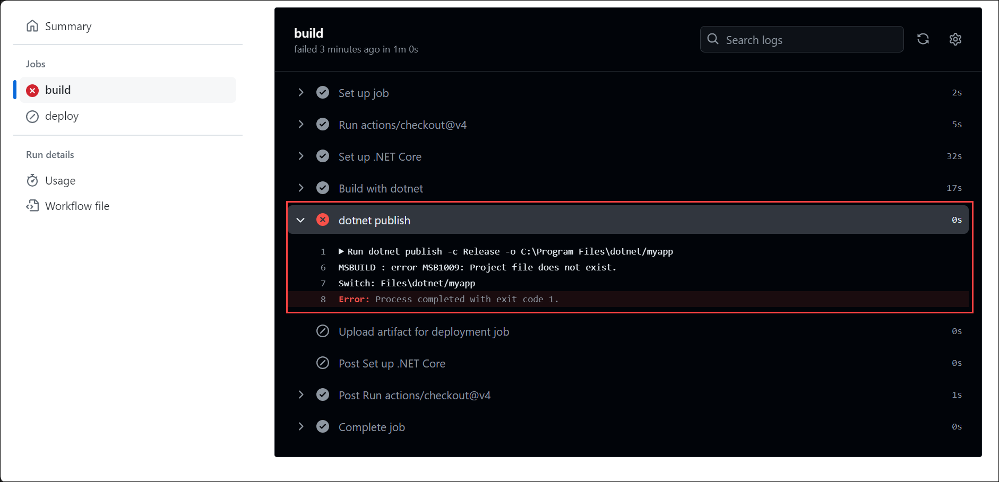
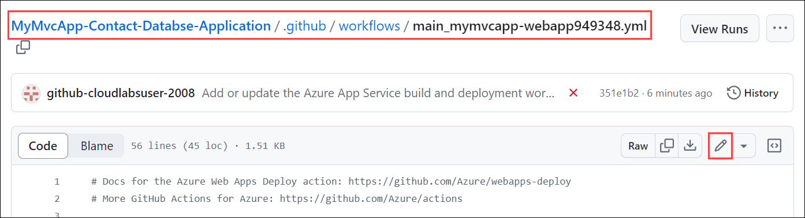
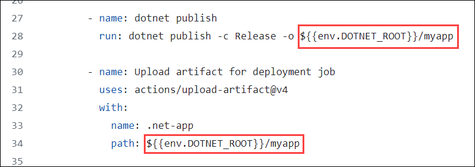
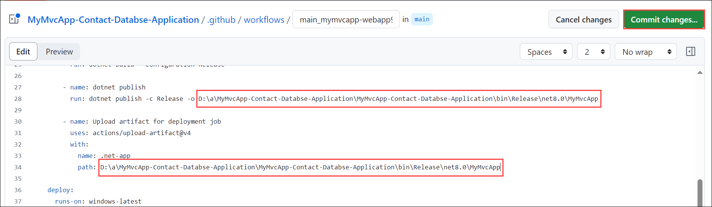
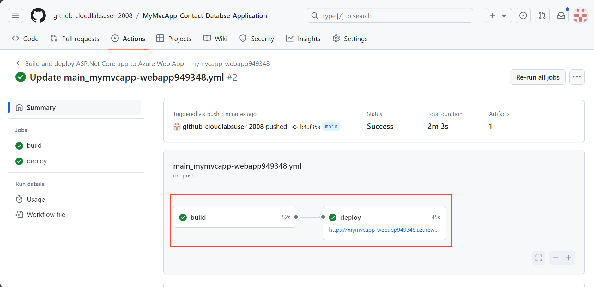
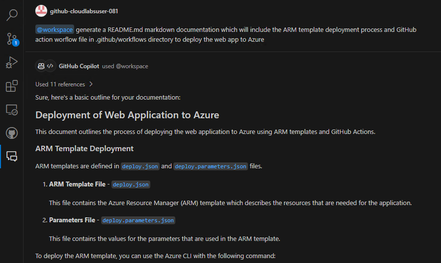

# Desafio 3: Deployment de applicações para Azure - Guia da Solução

## Aceder ao Portal de Azure

1. Para acessar o portal do Azure, abra uma janela privada/incógnita no seu browser e navegue até **[Azure Portal](https://portal.azure.com)**.

1. Na aba **Sign in to Microsoft Azure**, você verá uma tela de login. Insira o seguinte e-mail/nome de usuário e clique **Next**. 
   * Email/Username: <inject key="AzureAdUserEmail"></inject>
        
1. Agora insira a seguinte senha e clique em **Sign in**.
   * Password: <inject key="AzureAdUserPassword"></inject>
     
1. Se você vir o pop-up **Stay Signed in?** clique em Não.

1. Se você vir o pop-up **You have free Azure Advisor recommendations!**, feche a janela para continuar o laboratório.

1. Se aparecer uma janela pop-up **Welcome to Microsoft Azure**, clique em **Maybe Later** para pular o tour.
   
1. Agora você verá o Painel do Portal do Azure. Clique em **Resource groups** no painel de navegação para ver os resource groups.
  
1. Confirme que você tem um resource group com o nome **GitHub-Copilot-Challenges** presente, conforme mostrado na captura de tela abaixo. Você precisará usar o resource group **GitHub-Copilot-Challenges** ao longo deste desafio.

## Task 1: Desenvolva um template ARM para implantar um aplicativo no Azure

In this task, you'll be generating an ARM template to deploy a web application to Azure using Azure App Services and defining the necessary resources.

1. In your GitHub Copilot Chat window, ask the GitHub Copilot to generate an ARM template to deploy a web app with the necessary resources defined (basic/free pricing plan, basic authentication enabled, and GitHub actions setting disabled).

   

1. O GitHub Copilot gerará um ARM template básico (que pode não ser preciso). Copie e cole o ARM template em um novo arquivo chamado **deploy.json** e utilize as Sugestões e o Chat do GitHub Copilot para refatorar o template de acordo com suas especificações. Seu ARM template deve se assemelhar ao mostrado abaixo, com os recursos e especificações.

   ```
   {
    "$schema": "http://schema.management.azure.com/schemas/2015-01-01/deploymentTemplate.json#",
    "contentVersion": "1.0.0.0",
    "parameters": {
        "subscriptionId": {
            "type": "String"
        },
        "resourceGroupName": {
            "type": "String"
        },
        "name": {
            "type": "String"
        },
        "location": {
            "type": "String"
        },
        "hostingPlanName": {
            "type": "String"
        }
    },
    "variables": {},
    "resources": [
        {
            "type": "Microsoft.Web/sites",
            "apiVersion": "2018-11-01",
            "name": "[parameters('name')]",
            "location": "[parameters('location')]",
            "dependsOn": [
                "[concat('Microsoft.Web/serverfarms/', parameters('hostingPlanName'))]"
            ],
            "tags": {},
            "properties": {
                "name": "[parameters('name')]",
                "siteConfig": {
                    "appSettings": [],
                    "metadata": [
                        {
                            "name": "CURRENT_STACK",
                            "value": "dotnet"
                        }
                    ],
                    "phpVersion": "OFF",
                    "netFrameworkVersion": "v8.0",
                    "alwaysOn": false,
                    "ftpsState": "FtpsOnly"
                },
                "serverFarmId": "[concat('/subscriptions/', parameters('subscriptionId'),'/resourcegroups/', parameters('resourceGroupName'), '/providers/Microsoft.Web/serverfarms/', parameters('hostingPlanName'))]",
                "clientAffinityEnabled": true,
                "virtualNetworkSubnetId": null,
                "httpsOnly": true,
                "publicNetworkAccess": "Enabled"
            },
            "resources": [
                {
                    "type": "Microsoft.Web/sites/basicPublishingCredentialsPolicies",
                    "apiVersion": "2022-09-01",
                    "name": "[concat(parameters('name'), '/scm')]",
                    "dependsOn": [
                        "[resourceId('Microsoft.Web/Sites', parameters('name'))]"
                    ],
                    "properties": {
                        "allow": true
                    }
                },
                {
                    "type": "Microsoft.Web/sites/basicPublishingCredentialsPolicies",
                    "apiVersion": "2022-09-01",
                    "name": "[concat(parameters('name'), '/ftp')]",
                    "dependsOn": [
                        "[resourceId('Microsoft.Web/Sites', parameters('name'))]"
                    ],
                    "properties": {
                        "allow": true
                    }
                }
            ]
        },
        {
            "type": "Microsoft.Web/serverfarms",
            "apiVersion": "2018-11-01",
            "name": "[parameters('hostingPlanName')]",
            "location": "[parameters('location')]",
            "dependsOn": [],
            "tags": {},
            "sku": {
                "Tier": "Basic",
                "Name": "B1"
            },
            "kind": "",
            "properties": {
                "name": "[parameters('hostingPlanName')]",
                "workerSize": "0",
                "workerSizeId": "0",
                "numberOfWorkers": "1",
                "zoneRedundant": false
            }
         }
      ] 
   }
   ```

1. No VS Code, crie um novo arquivo **deploy.parameters.json** para definir os parâmetros a partir do seu arquivo *deploy.json*.

   ```
   {
    "$schema": "https://schema.management.azure.com/schemas/2015-01-01/deploymentParameters.json#",
    "contentVersion": "1.0.0.0",
    "parameters": {
        "subscriptionId": {
            "type": "String"
        },
        "resourceGroupName": {
            "type": "String"
        },
        "name": {
            "type": "String"
        },
        "location": {
            "type": "String"
        },
        "hostingPlanName": {
            "type": "String"
        }
     }
   }
   ```
  
1. No Portal de Azure, procure pelo serviço **Deploy a custom template**. Você usará este serviço do Azure para implementar seu ARM template personalizado.

   

1. Na aba Custom deployment, clique em **Build your own template in editor**.

   
 
1. Na aba Edit Template, exclua o ARM template básico existente, cole o novo ARM template gerado usando o GitHub Copilot e clique em **Save**.

   

1. Insira as especificações para implementar o seu aplicativo web. Certifique-se de implementar o aplicativo web no resource group existente chamado **GitHub-Copilot-Challenges**.

1. Depois de especificar todos os parâmetros, clique em **Review and Create**, e depois em **Create**.

    
1. Aguarde o final da implementação com sucesso e verifique se os recursos Web App e App Service Plan existem no resource group.

   

## Task 2: Gerar um workflow de GitHub Action usando o Deployment Center de Azure App Service do portal do Azure

Nesta tarefa, você criará um workflow de GitHub Action usando o Deployment Center da Web App no portal do Azure.

1. Navegue até o serviço do seu app service, e nas configurações de **Deployment**, selecione **Deployment Center**.

   

1. Especifique as seguintes configurações para gerar um arquivo YAML relativo ao workflow de GitHub Action e clique **Save**:

   * **Source**: GitHub
   * **Signed in as**: A sua conta de GitHub Account
   * **Organization**: A sua organização de GitHub
   * **Repository**: O seu repositório de Github (**MyMvcApp-Contact-Database-Application**)
   * **Branch**: O seu Branch
   * **Runtime stack**: .NET
   * **Version**: v8.0
   * **Authentication type**: Basic authentication
  
   

   

1. Você também pode visualizar a configuração do seu workflow clicando no botão **Preview file**.

1. Navegue até o seu repositório do GitHub e, na tab **Actions**, você verá que a build da susa web app web foi iniciada.

   

1. O workflow falhará com um erro de **build**, indicando que o processo foi concluído com o exit code 1 devido a um problema de caminho indefinido no arquivo YAML do seu workflow.

   

   

1. Agora, vamos navegar até o arquivo YAML do workflow, e editar o arquivo e definindo os caminhos para os passos **dotnet publish** e **Upload artifact for deployment job**.
Now let us navigate to the workflow YAML file by editing the file and defining the paths for the steps **dotnet publish** and **Upload artifact for deployment job**.

   

1. Localize os passos **dotnet publish** e **Upload artifact for deployment job** no seu arquivo de workflow e substitua os caminhos **${{env.DOTNET_ROOT}}/myapp** por **D:\a\MyMvcApp-Contact-Databse-Application\MyMvcApp-Contact-Databse-Application\bin\Release\net8.0\MyMvcApp** e clique em **Commit changes**.

   

   

1. Volte para a tab **Actions**. Você notará que a build da sua web app reiniciou após a definição dos caminhos. Aguarde até que a build do workflow seja concluída com sucesso.

   

## Task 3: Coloque a aplicação a funcionar no Azure

Nesta tarefa, você verificará se a build do pipeline do GitHub Action foi concluída com sucesso, se o arquivo de workflow foi criado e se sua  web app está funcionando conforme o esperado no Azure.

1. Nas configurações de Actions do seu repositório GitHub, verifique se a build do pipeline de ambos os jobs foi concluída com sucesso **(1)**.

   

1. Verifique se a sua web app está funcionando conforme o esperado navegando até a web application **(2)** em uma nova tab.

   

1. Além disso, verifique se seu arquivo de workflow foi criado em um novo diretório **.github/workflows**.

   

1. Seu arquivo de workflow do GitHub estará no formato abaixo:

   ```
   # Docs for the Azure Web Apps Deploy action: https://github.com/Azure/webapps-deploy
   # More GitHub Actions for Azure: https://github.com/Azure/actions

   name: Build and deploy ASP.Net Core app to Azure Web App - mymvcapp-webapp949348

   on:
     push:
       branches:
         - main
     workflow_dispatch:

   jobs:
     build:
       runs-on: windows-latest

       steps:
         - uses: actions/checkout@v4

         - name: Set up .NET Core
           uses: actions/setup-dotnet@v4
           with:
             dotnet-version: '8.x'

         - name: Build with dotnet
           run: dotnet build --configuration Release

         - name: dotnet publish
           run: dotnet publish -c Release -o D:\a\MyMvcApp-Contact-Databse-Application\MyMvcApp-Contact-Databse-Application\bin\Release\net8.0\MyMvcApp

         - name: Upload artifact for deployment job
           uses: actions/upload-artifact@v4
           with:
             name: .net-app
             path: D:\a\MyMvcApp-Contact-Databse-Application\MyMvcApp-Contact-Databse-Application\bin\Release\net8.0\MyMvcApp

     deploy:
       runs-on: windows-latest
       needs: build
       environment:
         name: 'Production'
         url: ${{ steps.deploy-to-webapp.outputs.webapp-url }}
    
       steps:
         - name: Download artifact from build job
           uses: actions/download-artifact@v4
           with:
             name: .net-app
      
         - name: Deploy to Azure Web App
           id: deploy-to-webapp
           uses: azure/webapps-deploy@v3
           with:
             app-name: 'mymvcapp-webapp949348'
             slot-name: 'Production'
             package: .
             publish-profile: ${{ secrets.AZUREAPPSERVICE_PUBLISHPROFILE_EA47AEBAC2C64100A420A4304676DAF5 }}
   ```

1. Você também pode verificar o funcionamento da sua web app navegando até o portal do Azure, App Service, Overview e clicando em **Default Domain**.

   

## Task 4: Gerar documentação com Copilot para o aplicativo

Nesta tarefa, você usará o GitHub Copilot para gerar uma documentação específica para este desafio, que incluirá o template ARM e o arquivo de workflow do GitHub Action para implementar a web app no Azure.

1. Na janela de Chat do GitHub Copilot, peça ao GitHub Copilot para gerar a documentação que especifique o deployment do template ARM e o arquivo de workflow do GitHub Action para implementar a web app no Azure para o seu workspace.

   * @workspace generates documentation that will include the ARM template deployment process and GitHub action workflow file in the .github/workflows directory to deploy the web app to Azure.

1. Você notará que o GitHub Copilot gera uma breve documentação sobre o deployment do template ARM do seu workspace para o Azure, o funcionamento do arquivo de workflow e alguns arquivos de configuração.

   ```
   # Deployment of Web Application to Azure
   This document outlines the process of deploying the web application to Azure using ARM templates and GitHub Actions.

   ## ARM Template Deployment
   ARM templates are defined in deploy.json and deploy.parameters.json files.

   ### ARM Template File - deploy.json

   This file contains the Azure Resource Manager (ARM) template which describes the resources that are needed for the application.

   ### Parameters File - deploy.parameters.json

   This file contains the values for the parameters that are used in the ARM template.

   ### To deploy the ARM template, you can use the Azure CLI with the following command:

   az deployment group create --name ExampleDeployment --resource-group ExampleGroup --template-file ./deploy.json --parameters ./deploy.parameters.json

   ## GitHub Actions Workflow
   The GitHub Actions workflow is defined in the .github/workflows directory.

   #### Workflow File - .github/workflows/workflow.yml

   This file contains the GitHub Actions workflow that automates the deployment process. It is triggered on a push to the main branch and it runs the Azure CLI command to deploy the ARM template.

   In this workflow, replace ExampleDeployment and ExampleGroup with your actual deployment name and resource group name. Also, make sure to store your Azure credentials as a secret in your GitHub repository.

   ## Web Configuration
   The web application's configuration is defined in the Web.config, Web.Debug.config, and Web.Release.config files.

   ### Web Configuration File - Web.config

   This file contains the main configuration for the web application.

   ### Debug Configuration File - Web.Debug.config

   This file contains the configuration for the web application when it is in debug mode.

   ### Release Configuration File - Web.Release.config

   This file contains the configuration for the web application when it is in release mode.
   ```

   


