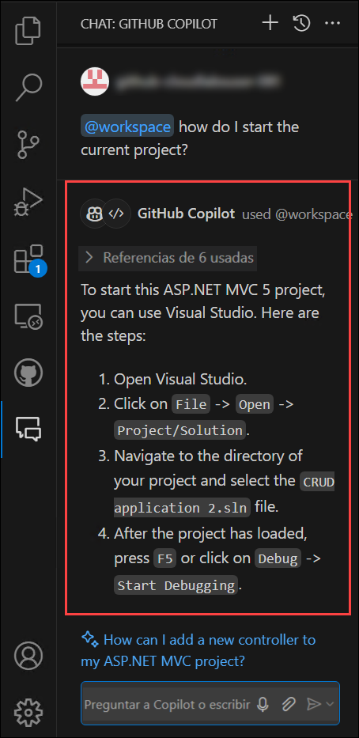
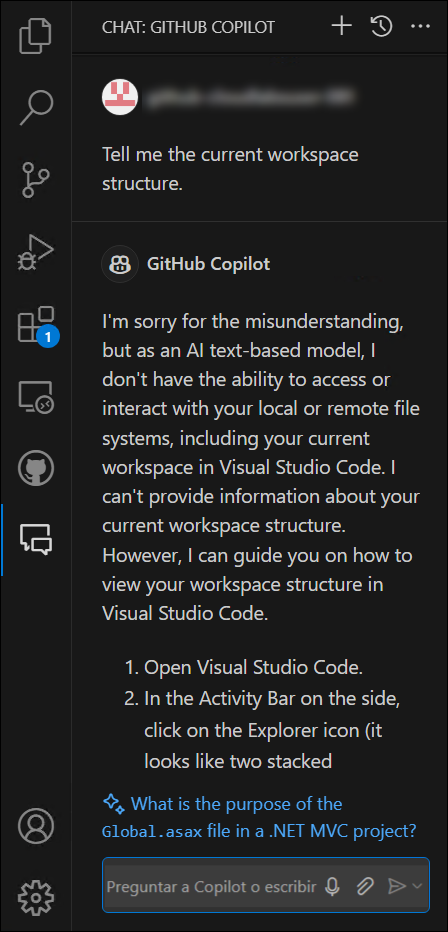

# Desafio 4: Usar GitHub Copilot workspace and referêencia a arquivos - Guia da Solução

>**Note:** The results produced by **GitHub Copilot** for this particular task may not precisely align with your outcomes. This discrepancy occurs because **Github Copilot** is an AI-driven tool that can yield variable outputs from time to time.

### Task 1: Utilizar o GitHub Copilot Workspace

Nesta tarefa, você utilizará o GitHub Copilot Workspace para aumentar a eficiência na escrita de código, fornecendo sugestões de código contextualmente relevantes.

1. Usando o VS Code onde você está conectado com os detalhes da conta do GitHub fornecidos pelo CloudLabs, abra o seu projeto.

    

1. No painel à esquerda, selecione o ícone **Chat**. Você será apresentado com a janela de boas-vindas do **GitHub Copilot**.

    

1. Na caixa de texto, digite **@** e selecione **Workspace** para começar a trabalhar com o agente do **GitHub Copilot Workspace**.

    

1. Agora, você pode fornecer seus próprios comandos e selecionar **Submit** para obter a resposta. Para começar, você pode perguntar ao **GitHub Copilot Chat** como iniciar seu projeto atual, fornecendo o seguinte comando: `How do I start the current project?`. Ao enviar seu comando, o Copilot analisará automaticamente os arquivos e diretórios do workspace atual e dividirá em etapas:

    1. Examina os nomes dos arquivos ou diretórios para entender quais são potencialmente relevantes para fornecer uma resposta.

    1. Leia o conteúdo dos arquivos. Às vezes o arquivo inteiro, às vezes apenas partes dele (devido aos limites de memória de tokens).

    1. Cria contexto a partir de tudo o que conseguiu coletar.

    1. Começa a responder, combinando o contexto do comando com o que foi capaz de obter..

    

1. O **GitHub Copilot** fornecerá uma explicação passo a passo de como executar seu projeto. Você pode seguir as mesmas etapas e verificar se seu projeto está funcionando corretamente.

    

1. Além disso, você também pode executar o comando `Tell me the current workspace structure.` sem a ajuda do **Workspace agent**, e comparar os outputs.

    

    O output fornecido é extremamente abstrato e, no final, informa que não pode fornecer a solução exata, gerando apenas uma solução genérica.
 
1. Depois disso, você pode tentar o comando usando a funcionalidade **Workspace** e obter informações completas sobre o seu projeto atual, fornecendo o seguinte prompt: `@workspace Tell me about the current workspace structure.`

    

    Analise o output gerado e verifique se a estrutura está alinhada com a estrutura real do seu projeto. 

1. Você também pode experimentar os seguintes prompts de exemplo, fornecer seus próprios prompts conforme sua curiosidade e necessidades, e verificar o output:

    ```
    @workspace Create a new lazy-loaded page with the path “/faq.”
    ```
    ```
    @workspace How can I add a new route to my ASP.NET MVC application?
    ```
    ```
    @workspace How can I handle form submissions in ASP.NET MVC?
    ```
    
### Task 2: Utilizar o GitHub Copilot Workspace para criar um novo Application Workspace

O GitHub Copilot Workspace não apenas fornece instruções, respostas ou trechos de código detalhados para as consultas que você envia, mas também pode criar o workspace completo de uma aplicação do zero. Aqui, você criará um novo aplicativo React simples chamado **Expense Tracker** para rastrear as despesas dos usuários e também modificá-las (editar) ou excluí-las, tudo com a ajuda do **GitHub Copilot workspace**. Você irá efetuar debug do aplicativo usando esta funcionalidade e verificar que ele funciona corretamente no seu ambiente local. Para criar o aplicativo `Expense Tracker` usando o **GitHub Copilot workspace**, siga os passos abaixo:

1. Abra uma nova janela no **VS code** escolhendo **File** na barra superior e, em seguida, selecionando **New Window**.

    

1. Agora, selecione **Open Folder** na página de **Welcome**, navegue até a pasta DemoApp e clique duas vezes para abri-la no seu VS Code.

    

1. No painel à esquerda, selecione o ícone **Chat**. Você será apresentado à janela de boas-vindas do **Github Copilot** .

    

1. Na caixa de texto, digite **@** e selecione **Workspace** para começar a trabalhar com o agente do **Github Copilot Workspace**.

    

1. Use o seguinte prompt, `**Create a workspace for the Expense Tracker React application with all the necessary files and code**.` Na caixa de texto, selecione **Submit**  para gerar o workspace completo da sua aplicação React Expense Tracker, junto com alguns arquivos de componentes.

    

    >**Nota:** A versão atual do **Github Copilot Workspace** permite criar o workspace automaticamente com toda a estrutura de arquivos; basta clicar em **Create Workspace**.

1. Agora, crie o workspace para sua aplicação **Expense Tracker** criando os arquivos e pastas necessários. Para isso, selecione **Explorer** no painel à esquerda e escolha os ícones de arquivo ou pasta apropriados para criar um novo arquivo ou pasta conforme a estrutura do workspace da sua aplicação.

    

1. A estrutura do workspace para sua aplicação **Expense Tracker** deve se parecer com isto, de acordo com o output gerado pelo **GitHub Copilot Workspace**:

    

1. Agora, gere o código para todos os componentes necessários da sua aplicação fornecendo os comandos relevantes ao **GitHub Copilot** na seção **Chat**. Por exemplo, para criar o código para o componente **ExpenseForm.js** da sua aplicação, escreva `@workspace. How can I add functionality to the ExpenseForm component to handle user input and save expenses?` e selecione **Submit**.

    O **GitHub Copilot** fornecerá o código relacionado ao componente referenciado.

    

1. Selecione o ícone **Copy** para copiar o código e cole-o no componente **ExpenseForm.js** correspondente. Salve o arquivo.

    

    >**Nota:** Leia a saída gerada pelo **Copilot** com atenção e certifique-se de instalar todos os pacotes necessários, se solicitado pelo Copilot, antes de executar sua aplicação.

1. Faça o mesmo para todos os componentes necessários da sua aplicação sugeridos pelo **GitHub Copilot Workspace** no **GitHub Copilot Chat**, e complete todos os componentes.

1. Certifique-se de utilizar o **GitHub Copilot Workspace** em caso de qualquer erro em algum dos componentes da sua aplicação. Por exemplo, se um problema aparecer no arquivo **app.js** da sua aplicação, você pode fornecer um prompt semelhante ao dado para descobrir a causa do erro e usar as capacidades avançadas do **GitHub Copilot Workspace** para corrigir o erro: `@workspace. Fix the issue in the app.js file.`

    >**Nota:** Certifique-se de usar o comando **@workspace** na caixa de chat para utilizar a funcionalidade de workspace, para que ele possa analisar todos os arquivos e diretórios do seu workspace e fornecer a melhor solução para o erro, sem conflitar com outros componentes.

1. Você receberá uma saída semelhante a esta:

    

    Revise a resposta e resolva os erros usando os passos fornecidos.

1. Agora, quando todos os erros tiverem sido corrigidos, você pode perguntar ao Copilot como executar sua aplicação com o prompt `@workspace. How can I run this app?`.

    Siga os passos fornecidos e execute sua aplicação.

    

1. Você também pode verificar se todos os pré-requisitos necessários para executar seu aplicativo **Expense Tracker** já estão instalados fornecendo ao Copilot o comando `@workspace. What are the prerequisites I should install to run this app?`

    

    Revise atentamente a resposta gerada pelo **GitHub Copilot** usando sua funcionalidade de workspace e certifique-se de que todos esses pré-requisitos estão instalados. Caso contrário, instale-os seguindo os passos mencionados na resposta.

1. Execute a aplicação, e ela será aberta no seu browser **Edge** como mostrado abaixo:

    

### Task 3: Utilize as capacidades de file referencing

**File Referencing in GitHub Copilot** refere-se à capacidade da IA de entender e interpretar o contexto do seu projeto considerando as informações contidas em outros arquivos dentro do seu workspace.

Quando você está trabalhando em um arquivo específico no seu código, o **GitHub Copilot** pode levar em consideração as informações, funções, classes ou variáveis definidas em outros arquivos do seu projeto. Isso significa que ele não fornece apenas sugestões com base no arquivo atual em que você está trabalhando; ele também pode referenciar outros arquivos para oferecer conclusões de código mais precisas e relevantes. Essa funcionalidade é particularmente útil quando você está trabalhando em projetos grandes, onde o código está distribuído por vários arquivos. A capacidade do **GitHub Copilot** de referenciar outros arquivos permite que ele entenda melhor o panorama geral do seu projeto, resultando em sugestões mais contextualizadas. Isso pode melhorar significativamente sua eficiência de codificação e a qualidade geral do seu código.

Nesta tarefa, você utilizará a funcionalidade de **GitHub Copilot File Referencing** para aumentar a eficiência da codificação, fornecendo sugestões de código contextualmente relevantes. Para usar o recurso de Referência de Arquivos, siga os passos abaixo:

1. Abra o seu projeto Expense Tracker no **VS Code**, onde você está conectado com a conta do GitHub fornecidos pela CloudLabs.

    

1. No painel à esquerda, selecione o ícone **Chat**. Você será apresentado à janela de boas-vindas do **GitHub Copilot**.

    

1. Na caixa de texto, digite **@** e selecione **Workspace** para ativar o agente do **GitHub Copilot Workspace**. Você precisará desse agente para analisar todo o seu workspace, para que ele possa fornecer respostas precisas e os blocos de código relacionados, referenciando os arquivos corretos.

    

1. Agora, você pode usar o seguinte comando para entender como a funcionalidade de referência de arquivos funciona no **GitHub Copilot**. Ele pode fornecer uma resposta precisa para o arquivo ao qual você faz referência:: `What is the purpose of the index.js file in my project?`

    O **GitHub Copilot** fará referência às informações, funções, classes ou variáveis definidas no arquivo sobre o qual você fez a pergunta e fornecerá uma explicação detalhada do que está no **index.js**. Não apenas a explicação; ele também fornecerá o código relacionado acompanhado da resposta, referenciado no arquivo fornecido.

    O **GitHub Copilot** também referencia automaticamente os arquivos adicionais em seu projeto que podem ser necessários para fornecer a melhor resposta. Para obter informações sobre esses arquivos, selecione **Used n references** (onde **n** é o número total de arquivos referenciados do seu projeto atual) presente no início da resposta e veja todos os arquivos que o **GitHub Copilot** referenciou para lhe fornecer a resposta.

    

    Alguns outros prompts que você pode fornecer para entender a funcionalidade de referência de arquivos são:

    ```
    @workspace What does the ExpenseList.js file do in my application?
    ```
    ```
    @workspace What is the purpose of the app.js file in my project?
    ```
    ```
    @workspace How can I change the CSS for my application?
    ```
    
#### **Adicionar uma nova funcionalidade na applicação usando File Reference:**

Nesta tarefa, você utilizará a capacidade de referência de arquivos para integrar um novo recurso em sua aplicação **Expense Tracker**. Você incluirá um campo **Date** no documento **ExpenseForm** e exibirá essa data no **ExpenseItem**, permitindo que você classifique as despesas por data no componente **ExpenseList**.

Para fazer isso, siga os passos abaixo:

1. onde você está conectado com a conta do GitHub fornecidos pela CloudLabs.

    

1. No painel à esquerda, selecione o ícone **Chat**. Você será apresentado à janela de boas-vindas do **GitHub Copilot**.

    

1. Na caixa de texto, digite **@** e selecione **Workspace** para ativar o agente do **GitHub Copilot Workspace**. Você precisará desse agente para analisar todo o seu workspace, para que ele possa fornecer respostas precisas e os blocos de código relacionados, referenciando os arquivos corretos.

    

1. Agora, forneça o seguinte prompt para incluir um novo campo **Data** nos componentes e permitir que os usuários classifiquem suas despesas conforme necessário: `How can I modify the ExpenseForm component to include a date field, display this date in the ExpenseItem component, and sort the expenses by date in the ExpenseList component?`

1. A funcionalidade do **GitHub Copilot**  fará referência aos arquivos que você mencionou nos comandos, além de analisar todo o seu workspace e fornecer a melhor resposta possível. Ele fornecerá os trechos de código que você pode adicionar aos componentes **ExpenseForm**, **ExpenseItem**, e **ExpenseList** conforme necessário. Você também pode visualizar os arquivos que foram referenciados ao fornecer a resposta selecionando **Used n references** (onde n é o número de arquivos referenciados) presente no início da resposta.

    

1. Você pode revisitar a resposta, fazer as alterações sugeridas pelo **GitHub Copilot** usando sua funcionalidade de referência de arquivos e editar os componentes conforme fornecido na resposta.

1. Execute o aplicativo e verifique se o componente **Date** foi adicionado e está funcionando corretamente.

    
