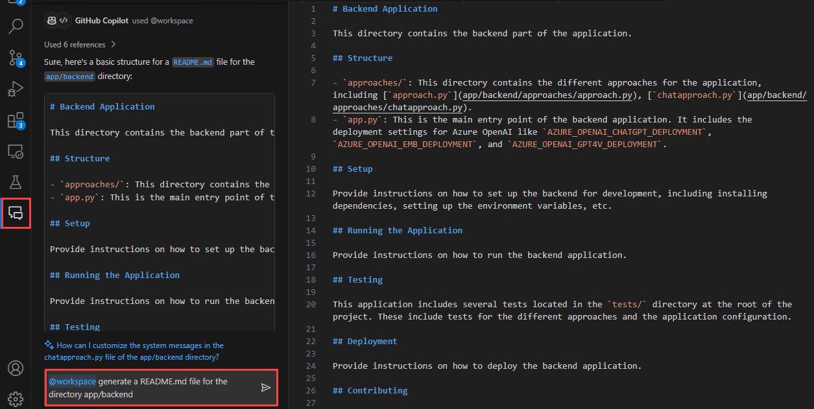
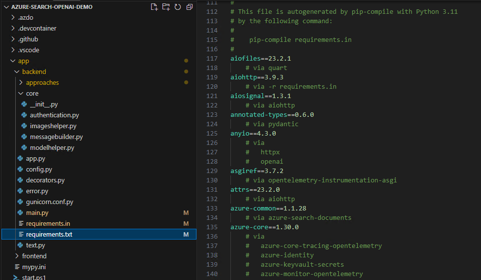
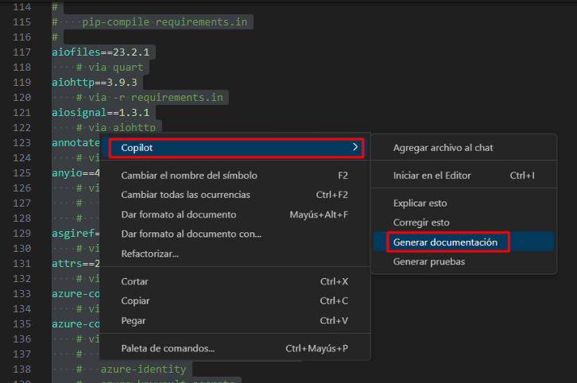
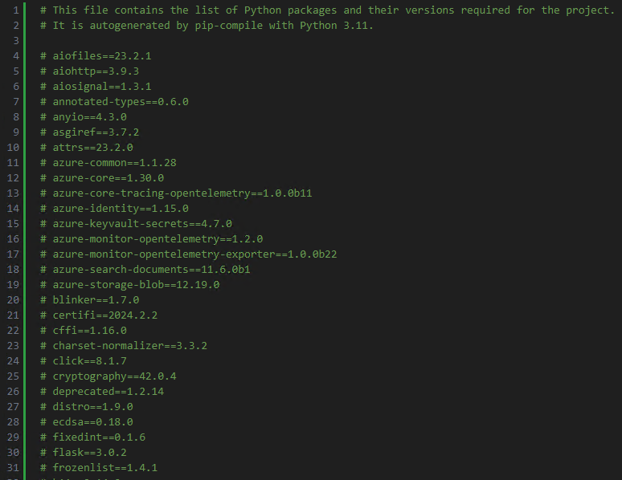
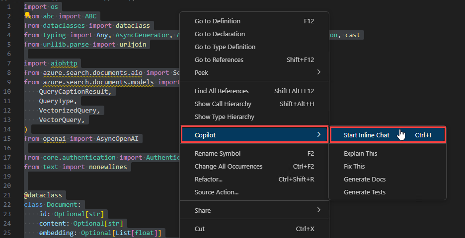
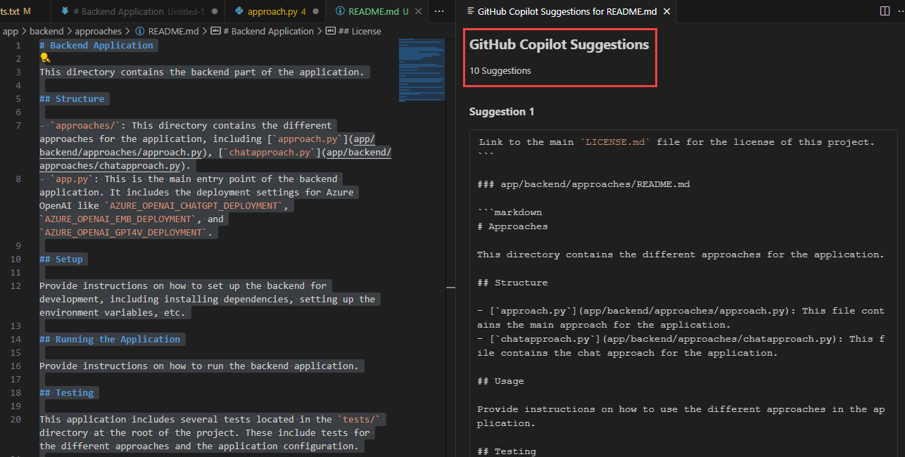

# Challenge 5: Create Documentation using GitHub Copilot - Solution Guide

## Task 1: Generate Documentation with Copilot

In this task, you'll utilize GitHub Copilot to generate markdown documentation for the backend application for the GitHub repository [Azure-Samples/azure-search-openai-demo](https://github.com/Azure-Samples/azure-search-openai-demo) and will also make us of GitHub Copilot features to generate comments for codes.

1. Open Visual Studio Code and clone the GitHub repository [Azure-Samples/azure-search-openai-demo](https://github.com/Azure-Samples/azure-search-openai-demo).

1. In the GitHub Copilot Chat window, ask the GitHub Copilot to generate a README.md file for the backend application, copy the code in a new file and save as **Copilot_README.md**. You can acheive this by refering to your workspace.

   - @workspace generate a README.md file for the directory app/backend

   

1. Notice how the GitHub Copilot uses the workspace reference to create a markdown documentation for a specific directory.

1. Navigate to the *app/backend/requirements.txt* file and browse through the requirements. 

   

1. Now select the entire file, right click and then select **Copilot** and **Generate Docs**.

   

1. Notice how the GitHub Copilot lists out all the requirements in the file at the beginning.

   

1. Navigate to *app/backend/approaches/approach.py* file. You will notice that there are no comments for the either of the modules, functions or classes.

1. Now select the entire file, right click and then select **Copilot** and **Start Inline Chat**. Ask the GitHub Copilot to generate comments for the selected code.

   

1. Notice how the GitHub Copilot generate comments for the classes, functions and modules present in the code.

## Task 2: Enhance and Refine Documentation

In this task, you'll enhance and refine your README.md documentation by utilizing GitHub Copilot Suggestions feature.

1. Open your **Copilot_README.md** file which you saved in the previous task.

1. Select the entire documentation and click **Ctrl+Enter** to view Suggestions provided by GitHub Copilot to enhance the documentation.

   

1. You'll find a number of suggestions for the selected document which help you refine the same.

1. Browse through the GitHub Copilot Suggestions and **Accept** the best suited suggestions suitable.

## Task 3: Explore Various Documentation Styles

In this task, you'll explore on various styles of documentation that you can generate by utilizing GitHub Copilot.

1. In your VS Code, create a new file, right click anywhere on the new file and select **Copilot** and **Start Inline Chat**.

1. Ask the GitHub Copilot to generate a markdown docmentation to deploy a VNet in Azure and click **Accept**.

1. You'll notice that the GitHub Copilot has generated a step by step markdown documentation to deploy a VNet in Azure.

   ```
   # Deploy a Virtual Network (VNet) in Azure

   ## Introduction
   In this guide, we will walk you through the steps to deploy a Virtual Network (VNet) in Azure. A VNet is a fundamental building block for any Azure infrastructure deployment, as it provides isolation and segmentation of resources.

   ## Prerequisites
   Before you begin, make sure you have the following:
   - An Azure subscription
   - Sufficient permissions to create resources in Azure
   
   ## Steps

   ### 1. Sign in to the Azure portal
   - Open a web browser and navigate to the [Azure portal](https://portal.azure.com).
   - Sign in with your Azure account.

   ### 2. Create a new Virtual Network
   - In the Azure portal, click on the **Create a resource** button.
   - Search for "Virtual Network" and select **Virtual Network** from the search results.
   - Click on the **Create** button to start the creation process.

   ### 3. Configure the Virtual Network
   - Provide a **Name** for the Virtual Network.
   - Select the appropriate **Subscription**.
   - Choose a **Resource group** or create a new one.
   - Select the **Region** where you want to deploy the Virtual Network.
   - Configure the **Address space** for the Virtual Network.
   - Optionally, configure the **Subnets** within the Virtual Network.
   - Click on the **Review + create** button to proceed.

   ### 4. Review and create the Virtual Network
   - Review the configuration settings for the Virtual Network.
   - Click on the **Create** button to start the deployment process.
   
   ### 5. Monitor the deployment
   - Once the deployment is initiated, you can monitor the progress in the Azure portal.
   - Wait for the deployment to complete.

   ## Conclusion
   Congratulations! You have successfully deployed a Virtual Network in Azure. You can now start using the Virtual Network to host your    Azure resources.

   ## Next Steps
   - Connect the Virtual Network to other Azure resources.
   - Configure network security and routing within the Virtual Network.
   - Explore advanced networking features in Azure.
   ```

1. You can also utilize GitHub Copilot Chat to generate a Javadoc to create a calculator.

   ```
   /**
    * This class represents a calculator that can perform basic arithmetic operations.
    */
   public class Calculator {
    
       /**
        * Adds two numbers and returns the result.
        *
        * @param num1 The first number.
        * @param num2 The second number.
        * @return The sum of the two numbers.
        */
       public int add(int num1, int num2) {
           return num1 + num2;
       }
    
       /**
        * Subtracts two numbers and returns the result.
        *
        * @param num1 The first number.
        * @param num2 The second number.
        * @return The difference between the two numbers.
        */
       public int subtract(int num1, int num2) {
           return num1 - num2;
       }
    
       /**
        * Multiplies two numbers and returns the result.
        *
        * @param num1 The first number.
        * @param num2 The second number.
        * @return The product of the two numbers.
        */
       public int multiply(int num1, int num2) {
           return num1 * num2;
       }
    
       /**
        * Divides two numbers and returns the result.
        *
        * @param num1 The first number.
        * @param num2 The second number.
        * @return The quotient of the two numbers.
        * @throws ArithmeticException if the second number is zero.
        */
       public double divide(int num1, int num2) {
           if (num2 == 0) {
               throw new ArithmeticException("Cannot divide by zero");
           }
           return (double) num1 / num2;
       }
   }
   /**
    * Performs multiplication for three variables or numbers.
    *
    * @param a The first number.
    * @param b The second number.
    * @param c The third number.
    * @return The result of multiplying the three numbers.
    */
   public int multiply(int a, int b, int c) {
       return a * b * c;
   }
   ```


