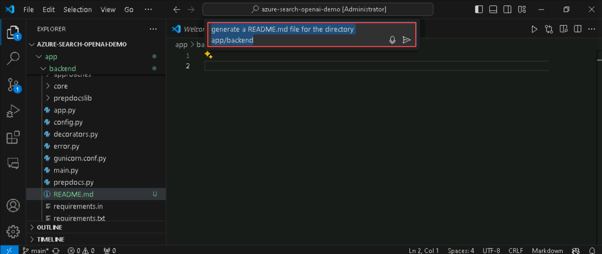
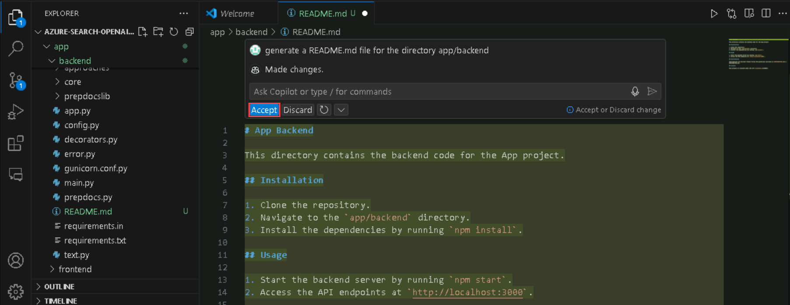
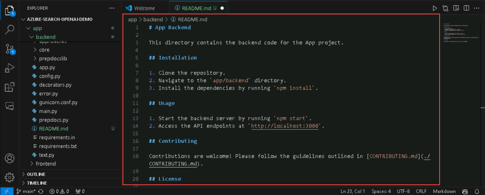
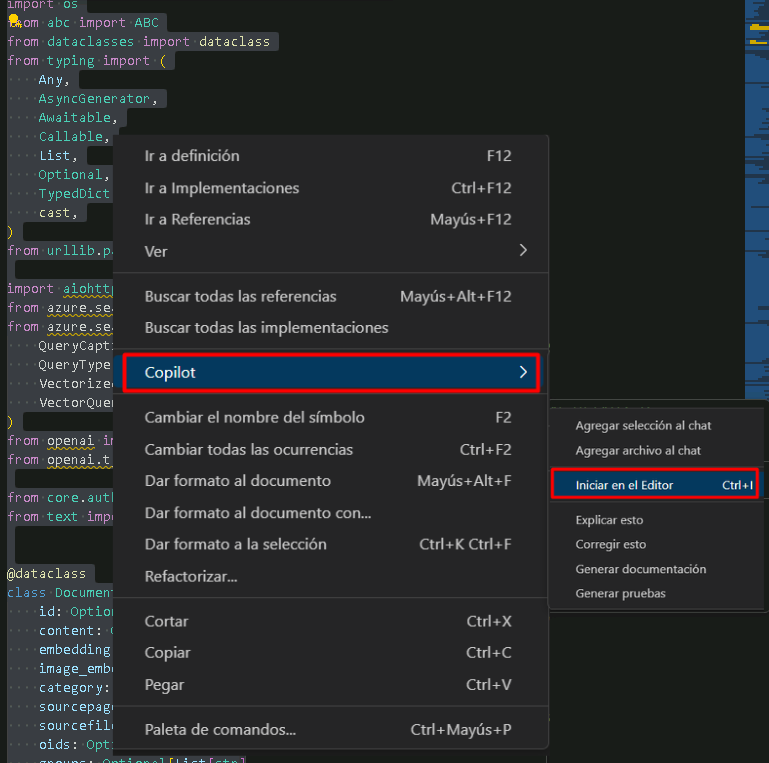
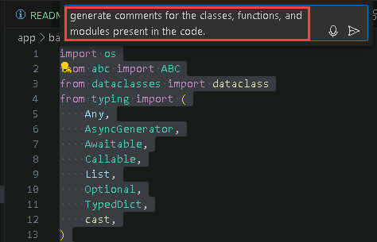

# Desafío 5: Crear Documentación con GitHub Copilot - Guía de Soluciones

## Tarea 1: Generar Documentación con Copilot

En esta tarea, utilizará GitHub Copilot para generar documentación en formato Markdown para la aplicación backend para el repositorio de GitHub [Azure-Samples/azure-search-openai-demo](https://github.com/Azure-Samples/azure-search-openai-demo) y también utilizará las características de GitHub Copilot para generar comentarios para los códigos.

1. Abra Visual Studio Code y clone el repositorio de GitHub [Azure-Samples/azure-search-openai-demo](https://github.com/Azure-Samples/azure-search-openai-demo).

1. Navegue hasta la carpeta **C:\Users\azureuser\azure-search-openai-demo\app\backend** y cree un nuevo archivo README.md.

1. En el archivo README.md vacío, haga clic en Ctrl+I para abrir la ventana GitHub Copilot Chat, solicite que genere un archivo README.md para el directorio app/backend.

   

1. Acepte el código generado de Copilot para reflejarlo en el archivo README.md

   

   

1. Navegue hasta el archivo *app/backend/requirements.txt* y examine los requisitos.

   

1. Ahora seleccione todo el archivo, haga clic derecho y luego seleccione **Copilot** y **Generar documentación**.

   

1. Observa cómo GitHub Copilot enumera todos los requisitos en el archivo al principio.

   

1. Navegue hasta el archivo *app/backend/approaches/approach.py*. Notará que no hay comentarios para ninguno de los módulos, funciones o clases.

1. Ahora seleccione todo el archivo, haga clic derecho y luego seleccione **Copilot** y **Iniciar en el Editor**. Pídale a GitHub Copilot que genere comentarios para el código seleccionado.

   

   

1. Observe cómo GitHub Copilot genera comentarios en el código.

## Tarea 2: Mejorar y Refinar la documentación

En esta tarea, mejorará y refinará su documentación README.md utilizando la función GitHub Copilot Suggestions.

1. Abra el archivo **README.md** que guardó en la tarea anterior.

1. Seleccione toda la documentación y haga clic en **Ctrl+Enter** para ver las sugerencias proporcionadas por GitHub Copilot para mejorar la documentación.

   

1. Encontrará una serie de sugerencias para el documento seleccionado que lo ayudarán a refinarlo.

1. Explore las sugerencias de GitHub Copilot y **Acepte** las sugerencias más adecuadas.

## Tarea 3: Explorar Varios Estilos de Documentación

En esta tarea, explorará los distintos estilos de documentación que puede generar utilizando GitHub Copilot.

1. En VS Code, cree un nuevo archivo, haga clic derecho en cualquier parte del nuevo archivo y seleccione **Copilot** y **Start Inline Chat**.

1. Pídale a GitHub Copilot que genere documentación de Markdown para implementar una VNet en Azure y haga clic en **Accept**.

1. Notará que GitHub Copilot ha generado documentación de Markdown paso a paso para implementar una VNet en Azure.

   ```
   # Deploy a Virtual Network (VNet) in Azure

   ## Introduction
   In this guide, we will walk you through the steps to deploy a Virtual Network (VNet) in Azure. A VNet is a fundamental building block for any Azure infrastructure deployment, as it provides isolation and segmentation of resources.

   ## Prerequisites
   Before you begin, make sure you have the following:
   - An Azure subscription
   - Sufficient permissions to create resources in Azure
   
   ## Steps

   ### 1. Sign in to the Azure portal
   - Open a web browser and navigate to the [Azure portal](https://portal.azure.com).
   - Sign in with your Azure account.

   ### 2. Create a new Virtual Network
   - In the Azure portal, click on the **Create a resource** button.
   - Search for "Virtual Network" and select **Virtual Network** from the search results.
   - Click on the **Create** button to start the creation process.

   ### 3. Configure the Virtual Network
   - Provide a **Name** for the Virtual Network.
   - Select the appropriate **Subscription**.
   - Choose a **Resource group** or create a new one.
   - Select the **Region** where you want to deploy the Virtual Network.
   - Configure the **Address space** for the Virtual Network.
   - Optionally, configure the **Subnets** within the Virtual Network.
   - Click on the **Review + create** button to proceed.

   ### 4. Review and create the Virtual Network
   - Review the configuration settings for the Virtual Network.
   - Click on the **Create** button to start the deployment process.
   
   ### 5. Monitor the deployment
   - Once the deployment is initiated, you can monitor the progress in the Azure portal.
   - Wait for the deployment to complete.

   ## Conclusion
   Congratulations! You have successfully deployed a Virtual Network in Azure. You can now start using the Virtual Network to host your    Azure resources.

   ## Next Steps
   - Connect the Virtual Network to other Azure resources.
   - Configure network security and routing within the Virtual Network.
   - Explore advanced networking features in Azure.
   ```

1. También puede utilizar GitHub Copilot Chat para generar un Javadoc para crear una calculadora.

   ```
   /**
    * This class represents a calculator that can perform basic arithmetic operations.
    */
   public class Calculator {
    
       /**
        * Adds two numbers and returns the result.
        *
        * @param num1 The first number.
        * @param num2 The second number.
        * @return The sum of the two numbers.
        */
       public int add(int num1, int num2) {
           return num1 + num2;
       }
    
       /**
        * Subtracts two numbers and returns the result.
        *
        * @param num1 The first number.
        * @param num2 The second number.
        * @return The difference between the two numbers.
        */
       public int subtract(int num1, int num2) {
           return num1 - num2;
       }
    
       /**
        * Multiplies two numbers and returns the result.
        *
        * @param num1 The first number.
        * @param num2 The second number.
        * @return The product of the two numbers.
        */
       public int multiply(int num1, int num2) {
           return num1 * num2;
       }
    
       /**
        * Divides two numbers and returns the result.
        *
        * @param num1 The first number.
        * @param num2 The second number.
        * @return The quotient of the two numbers.
        * @throws ArithmeticException if the second number is zero.
        */
       public double divide(int num1, int num2) {
           if (num2 == 0) {
               throw new ArithmeticException("Cannot divide by zero");
           }
           return (double) num1 / num2;
       }
   }
   /**
    * Performs multiplication for three variables or numbers.
    *
    * @param a The first number.
    * @param b The second number.
    * @param c The third number.
    * @return The result of multiplying the three numbers.
    */
   public int multiply(int a, int b, int c) {
       return a * b * c;
   }
   ```


