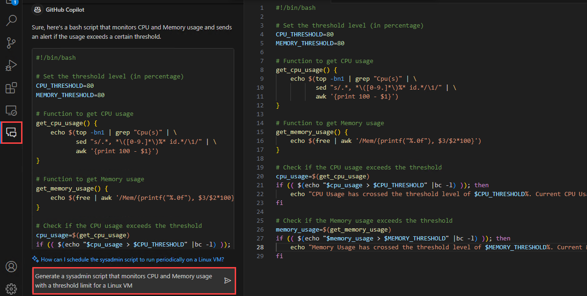
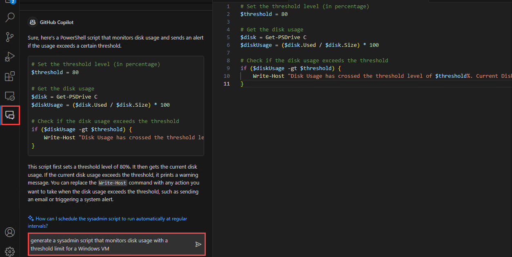
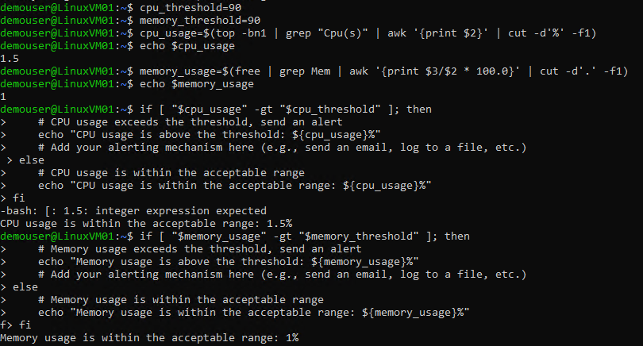
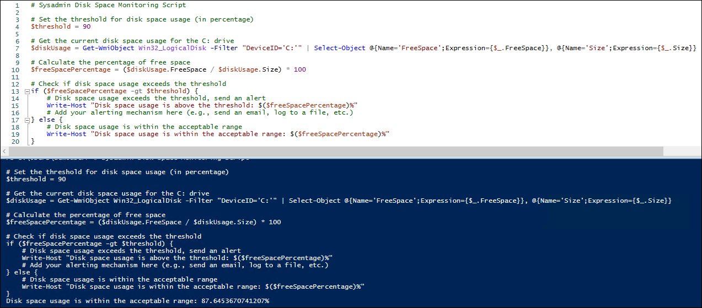

# Desafío 6: Generar Scripts con GitHub Copilot - Guía de Soluciones

## Tarea 1: Generar Scripts de Sysadmin (Administrador de Sistemas)

En esta tarea, utilizará GitHub Copilot para generar scripts sysadmin (de administrador de sistemas) de monitoreo de recursos para el uso de CPU y memoria para una Máquina Virtual (MV) de Linux y el uso de disco para una MV de Windows.

1. En VS Code, solicite a GitHub Copilot Chat que genere un script de administrador de sistemas que monitoree el uso de CPU y memoria con un límite de umbral para una MV de Linux y copie el script a un nuevo archivo.

   

1. Notará que GitHub Copilot genera un script bash que monitorea el uso de CPU y memoria para un cierto límite de umbral y también explica su uso.

1. Ahora, solicite a GitHub Copilot Chat que genere un script de administrador de sistemas que monitoree el uso de disco con un límite de umbral para una MV de Windows y copie el script a un nuevo archivo.

   

1. Notará que GitHub Copilot genera un script de PowerShell que monitorea el uso del disco para un límite de umbral determinado y también explica su uso.

## Tarea 2: Refactorizar o depurar los scripts generados

En esta tarea, refactorizará o depurará los scripts de administrador de sistemas generados por GitHub Copilot en la tarea anterior.

1. Seleccione el script completo y presione **Ctrl+Enter** para ver las sugerencias proporcionadas por GitHub Copilot para refactorizar o depurar el script.

1. **Acepte** las sugerencias más adecuadas para corregir los scripts.

1. También puede utilizar GitHub Copilot Inline Chat. Ordene a GitHub Copilot que mejore y corrija los scripts.

1. Guarde los archivos después de haber utilizado con éxito GitHub Copilot para refactorizar y corregir los scripts.

   - Script Bash para monitorear el uso de CPU y memoria en una MV de Linux.
     ```
     #!/bin/bash

     # Sysadmin Resource Monitoring Script

     # Set the thresholds for CPU and memory usage (in percentage)
     cpu_threshold=90
     memory_threshold=90

     # Get the current CPU usage
     cpu_usage=$(top -bn1 | grep "Cpu(s)" | awk '{print $2}' | cut -d'%' -f1)

     # Get the current memory usage
     memory_usage=$(free | grep Mem | awk '{print $3/$2 * 100.0}' | cut -d'.' -f1)

     # Check CPU usage
     if [ "$cpu_usage" -gt "$cpu_threshold" ]; then
         # CPU usage exceeds the threshold, send an alert
         echo "CPU usage is above the threshold: ${cpu_usage}%"
         # Add your alerting mechanism here (e.g., send an email, log to a file, etc.)
     else
         # CPU usage is within the acceptable range
         echo "CPU usage is within the acceptable range: ${cpu_usage}%"
     fi

     # Check memory usage
     if [ "$memory_usage" -gt "$memory_threshold" ]; then
         # Memory usage exceeds the threshold, send an alert
         echo "Memory usage is above the threshold: ${memory_usage}%"
         # Add your alerting mechanism here (e.g., send an email, log to a file, etc.)
     else
         # Memory usage is within the acceptable range
         echo "Memory usage is within the acceptable range: ${memory_usage}%"
     fi
     ```
     
   - Script de PowerShell para supervisar el uso del disco en una MV de Windows
     ```
     # Sysadmin Disk Space Monitoring Script

     # Set the threshold for disk space usage (in percentage)
     $threshold = 90

     # Get the current disk space usage for the C: drive
     $diskUsage = Get-WmiObject Win32_LogicalDisk -Filter "DeviceID='C:'" | Select-Object @{Name='FreeSpace';Expression={$_.FreeSpace}}, @{Name='Size';Expression={$_.Size}}

     # Calculate the percentage of free space
     $freeSpacePercentage = ($diskUsage.FreeSpace / $diskUsage.Size) * 100

     # Check if disk space usage exceeds the threshold
     if ($freeSpacePercentage -gt $threshold) {
         # Disk space usage exceeds the threshold, send an alert
         Write-Host "Disk space usage is above the threshold: $($freeSpacePercentage)%"
         # Add your alerting mechanism here (e.g., send an email, log to a file, etc.)
     } else {
         # Disk space usage is within the acceptable range
         Write-Host "Disk space usage is within the acceptable range: $($freeSpacePercentage)%"
     }
     ```

## Tarea 3: Ejecutar los scripts

En esta tarea, ejecutará los scripts de administrador de sistemas generados por GitHub Copilot en MVs de Linux y Windows.

1. Abra el símbolo del sistema e inicie sesión en su MV de Linux.

   > **Nota:** Ingrese el nombre de usuario del administrador, la contraseña y la dirección IP pública de su MV de Linux.

1. Ejecute cada comando en su script bash, el cual monitorea el uso de CPU y memoria y compruebe los resultados.

   

1. Abra PowerShell ISE como administrador, copie y pegue el script de PowerShell que monitorea el uso del disco en un archivo nuevo, ejecute el script y compruebe los resultados.

   

   
