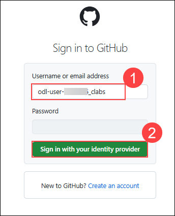
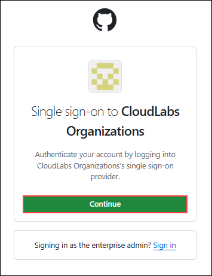
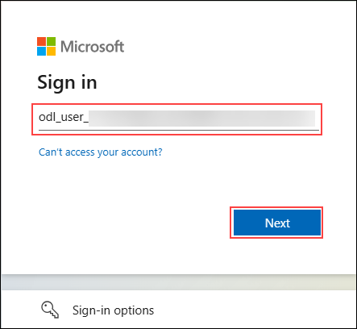
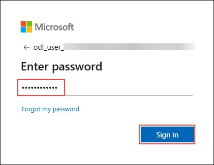

# Challenge 1: Getting Started with GitHub Copilot

### Estimated Time: 45 minutes

## Introduction

As a software developer at **Contoso Ltd.**, a leading software development company, you are tasked with researching and implementing innovative tools and technologies to enhance the company's coding process and productivity. The company is particularly interested in solutions that can improve code efficiency, streamline the development process, and enhance collaboration among its globally distributed teams.

**Contoso Ltd.** has identified **GitHub Copilot**, an AI-powered coding assistant, as a potential solution and enrolled you in a challenge series to explore and understand its capabilities. Your mission is to get started with **GitHub Copilot**, setting it up in your coding environment, exploring its features, and using it for code generation and suggestions. **GitHub Copilot** is a groundbreaking AI-powered coding companion seamlessly integrated into **Visual Studio Code**, designed to enhance your coding experience. By leveraging machine learning, Copilot assists developers in crafting code by intelligently suggesting completions and generating contextually relevant code snippets.

Imagine navigating a complex coding project and encountering puzzles that demand meticulous attention to detail. **GitHub Copilot** steps in as your coding ally, offering insightful suggestions and autocompletion tailored to the coding context. This not only boosts coding efficiency but also serves as a valuable learning tool, providing a deeper understanding of coding structures and patterns.

You will experiment with **GitHub Copilot** in various coding scenarios, such as creating a Python/JavaScript-based calculator and an application that fetches weather data from APIs. You will also leverage GitHub Copilot to refactor given code snippets and debug intentionally flawed code, thereby understanding the process of code improvement and effective debugging. Moreover, you will explore the integration of **GitHub Copilot** with GitHub Codespaces, a feature that extends the collaborative potential of your coding environment. This will allow you to understand how Copilot can be utilized in a collaborative coding environment, enabling teams to work seamlessly on projects regardless of geographical boundaries.

In this challenge series, you'll dive into **GitHub Copilot's** capabilities, starting with the setup and exploration of its features. From collaborative coding with GitHub Codespaces to experimenting with Copilot's suggestions and creating code for various tasks, you'll embark on a journey to harness the full potential of this revolutionary coding assistant. By the end of this challenge, you aim to demonstrate how **GitHub Copilot** can be effectively used to enhance coding productivity, improve code quality, and streamline the software development process at **Contoso Ltd**.

## Prerequisites

Make sure you have the following from the CloudLabs-provided integrated environment:

> **Note**: Prerequisites are already set up in the CloudLabs provided environment. If you're using your personal computer or laptop, please make sure that all necessary prerequisites are installed to complete this hackathon.

- [Visual Studio Code](https://code.visualstudio.com/)
- [GitHub account](https://github.com/)
- Python and NodeJs modules are installed in your Lab-VM in the directory **C:\Program Files**.

## Login to GitHub

1. In the LABVM desktop search for **Microsoft Edge** **(1)**, click on **Microsoft Edge** **(2)** browser.

   

1. Navigate to GitHub login page using the provided URL below:
   ```
   https://github.com/login
   ```
   
1. On the **Sign in to GitHub** tab, you will see the login screen. In that screen, provide the following **Username or email address**: **odl-user-<inject key="DeploymentID" enableCopy="false"/>_clabs** **(1)**. Then click on **Sign in with your identity provider** **(2)**. 
   
   
          
1. You will be redirected to **Single-Sign on** page, click on **Continue** button here.

   

1. On the **Sign in** tab you will see a login screen, enter the following email/username and then click on **Next**. 
   * Email/Username: **<inject key="AzureAdUserEmail" enableCopy="true"/>** 
   
      
     
1. Now enter the following password and click on **Sign in**.
   * Password: **<inject key="AzureAdUserPassword" enableCopy="true"/>**
   
      

1. If you see the pop-up **Stay Signed in?**, click **Yes**.

## Challenge Objectives:

1. **Setup GitHub Copilot in VS Code:**
   - Open Visual Studio Code, Navigate to **Extensions**, search for **Github Copilot** and click on **Install**
   - Configure the extension settings to suit your preferences.

      <validation step="afc73673-26ad-4c49-b013-4632e09d8634" />

2. **Login with a GitHub account:**
      - Login to GitHub within Visual Studio Code using the provided GitHub credentials provided in **Login to GitHub** section above.
      - Since you are already logged into GitHub in your browser, you just need to authorize Visual Studio Code to access your GitHub account.
      - Click on **Authorize Visual-Studio-Code** to provide additional permissions to GitHub for VS Code.

3. **Using GitHub Codespaces with Copilot:**
      - Create a Codespace for your GitHub repository. Navigate to **https://github.com/CloudLabsAI-Azure/Code-Generation-Refactoring** repository and fork this repository into the CloudLabs-provided GitHub account to create a new codespace.
      - Clone the above forked repository into Visual Studio Code using the CloudLabs-provided GitHub account.
      - Click the **+ icon** in the upper-right corner of GitHub and select **Import repository** from the dropdown menu.
      - Enter the URL of the repository you want to import. Set the **Owner** to **Cloudlabs-Enterprises**, and name the repository **Code-Generation-Refactoring-<inject key="DeploymentID" enableCopy="false"/>**. Once done, start the import process.
      - Understand how Copilot can be utilized in a collaborative coding environment.
      - Use the GitHub Codespaces to push/commit the local files from VS Code to GitHub in the next challenges.

4. **Copilot Function Test:**
     
   - Create a New Python File:

      - Open Visual Studio Code and create a new file named hello.py.

   - Utilising GitHub Copilot:
   
     - Press Ctrl + I to prompt GitHub Copilot for code suggestions.
     - In the Copilot mini window, type "Generate a basic Hello World program in Python.
     - Review the generated code, which should look like: 

     ```
       print("Hello, World!")
     ```

     - Click Accept to insert the code into your file.

     > **Hint**: Access the GitHub Copilot Suggestions window by pressing Ctrl + Enter in Visual Studio Code.

5. **Code Generation with Copilot and Copilot Chat:**
      - Create Python/JS-based code to build a calculator.
         - Utilize GitHub Copilot to assist in generating the code. Start by typing a comment like `# Create a basic calculator` to prompt Copilot to suggest code snippets. 
         - Implement various mathematical operations, such as addition, subtraction, multiplication, and division, as well as user interactions to take input and display results.
         - Once you’ve written the code, save the file as ***calculator.py*** if you’re using Python, or ***calculator.js*** if you’re using JavaScript, and push it to your forked **CloudLabsAI-Azure/Code-Generation-Refactoring** GitHub repository.
         - Feel free to experiment with additional features, like handling multiple calculations or improving the user interface.

      - Create a Python/JS-based app to get weather data from OpenWeatherMap APIs.
         - First, sign up for an account on the OpenWeatherMap website (https://openweathermap.org/).
           >**NOTE:** If you are already registered for an OpenWeatherMap account, kindly continue to use the same account.
         - Use GitHub Copilot to generate code that connects to the OpenWeatherMap API. Begin by writing a comment like # Fetch weather data from OpenWeatherMap API, which will help Copilot understand your goal and provide relevant code snippets.
         - Ensure that the code includes functionality for making API requests and processing the retrieved data to display weather information like temperature, humidity, and weather conditions.
         - Save this file as ***weather_script.py*** for Python or ***weather_script.js*** for JavaScript, and push it to your forked **CloudLabsAI-Azure/Code-Generation-Refactoring** GitHub repository.
         - Test the app by entering different locations to see how it retrieves and presents weather data.

      <validation step="b5244888-2b42-4686-b326-465182a86561" />

6. **Code Refactoring & Debugging:**
      - Refactor the `sum_elements.py` code from your forked **CloudLabsAI-Azure/Code-Generation-Refactoring** GitHub repository using Copilot, understanding the process of code improvement.
        >**Hint:** Utilize GitHub Copilot's **Refactor** feature.

      - Debug the `card_draw.py` code effectively from your forked **CloudLabsAI-Azure/Code-Generation-Refactoring** GitHub repository with Copilot's assistance, addressing and fixing identified issues. 
        >**Hint:** Utilize GitHub Copilot's **Fix** feature.

7. **Explore GitHub Copilot Features:**
      - Experiment with providing specific context or constraints in your comments. This helps Copilot generate more tailored code snippets that fit your unique coding style or project requirements.
      - Use Copilot to help you think through edge cases by asking it to generate code for scenarios that might not be immediately obvious. This can enhance your problem-solving skills and ensure your code handles various inputs effectively.
        >**Hint:** Access the GitHub Copilot Suggestions window by **Ctrl+Enter** shortcut in your VS Code.

## Success Criteria:

- Verify that GitHub Copilot is successfully installed and configured in Visual Studio Code and logged in.
- Successfully explored GitHub Codespaces integration and understood its collaboration features.
- Successfully tried out Copilot in coding scenarios, experiencing its code generation capabilities.
- Verify that Python/JS code for a calculator and an app to get weather data using Copilot were created and run successfully.
- Verify that your chosen piece of code is refactored successfully, with improved readability and overall quality.
- Verify that a piece of code with intentional errors is fixed successfully using Copilot's suggestions.

## Additional Resources:

- [GitHub Copilot Documentation](https://github.com/github/copilot-docs)
- [GitHub Codespaces Documentation](https://docs.github.com/en/codespaces)

### Conclusion

In this challenge, you successfully set up GitHub Copilot in Visual Studio Code, configured extension settings, and logged in with your GitHub account. You were also successful in creating Python/JS code for a calculator and an app to fetch weather data from OpenWeatherMap APIs. Additionally, you refined your coding skills by refactoring code snippets and debugging with Copilot's assistance.
