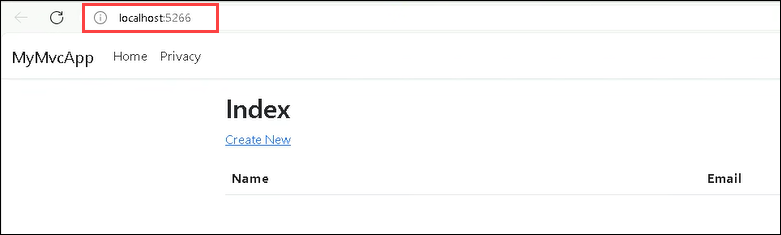
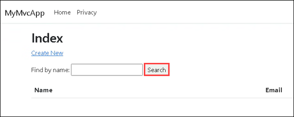

# Desafio 2: Criar uma applicação com GitHub Copilot

### Tempo Estimado: 60 minutos
  
## Introdução  

At **Contoso Ltd.**, a leading software development company, you, as a **software developer**, are given the task of exploring the capabilities of **GitHub Copilot**, an AI-powered coding assistant, and leveraging them in the company's software development process. The company believes that integrating AI into the development process can significantly enhance the efficiency and productivity of the development teams.

As part of this mission, you are assigned to develop a CRUD application named **MyMvcApp** using **GitHub Copilot**. The aim of this challenge is to understand the potential of AI in software development and to familiarize you with GitHub Copilot's capabilities. With the assistance of GitHub Copilot, you are expected to generate the necessary code, guided by the comments provided in the file. You will utilize GitHub Copilot at every stage of the development process, from generating code for empty methods to building essential features and testing the application thoroughly.

Throughout the challenge, you'll leverage Copilot's ability to understand context and provide relevant code suggestions. By engaging with Copilot Chat, you'll enhance collaboration and receive insightful coding recommendations, further enriching your coding experience.

By the end of this challenge, your goal is to have a fully functional **MyMvcApp CRUD Application**, developed mainly with the assistance of **GitHub Copilot**. Upon completion, you'll have not only developed a feature-rich application but also gained valuable insights into how AI can be seamlessly integrated into the development workflow. This hands-on experience with GitHub Copilot will empower you to explore its vast capabilities and unlock its potential in various development scenarios. This will demonstrate the potential of AI in software development and provide valuable insights into its practical implementation at **Contoso Ltd**.
  
## Prerequisites

Make sure you have the following from the CloudLabs-provided integrated environment:

- Basic understanding of the C# programming language.  
- GitHub account.
- Create a folder named **GitHub Copilot** in **C:\azureuser**.
- Run the below commands in command prompt to create a new folder named **MyMvcApp.Tests** in **C:\azureuser\GitHub Copilot** for generating unit test cases.

  ```
  cd "C:\azureuser\GitHub Copilot"
  ```
  ```
  dotnet new xunit -n MyMvcApp.Tests
  ```

## Setting Up Visual Studio Code

1. Sign in to Visual Studio Code using your GitHub User credentials from the **Environment Details > Licenses** tab.

2. Navigate to the below GitHub link and fork the repository into the CloudLabs-provided GitHub account.

   ```
   https://github.com/CloudLabsAI-Azure/MyMvcApp-Contact-Databse-Application
   ```

   > **Note:** You have already forked the provided GitHub repository in Challenge 01.
   
3. Clone the forked repository into Visual Studio Code using the CloudLabs-provided GitHub account.

4. In the Visual Studio Code, navigate to **Extensions**, search for **GitHub Copilot** and click on **Install**.

5. Wait for the GitHub Copilot extension to download completely (this might take a few minutes).

6. In your Visual Studio Code, locate the **MyMvcApp.Tests** folder in the Solution Explorer, right click and select **Open in integrated terminal**. Run the below command in the terminal to add the dotnet package.

      ```
      dotnet add package Microsoft.CodeDom.Providers.DotNetCompilerPlatform
      ```

## Challenge Objectives  
1. **Develop an app:** 

      - You will be creating a CRUD application named **MyMvcApp**, a C# application, with the help of **Github Copilot**, which will let the users save the contact details of people as per requirements and also carry out the basic functions like editing their details, deleting their profiles, and so on. You will be provided with the skeleton of the application already, but you will need to build the functionalities inside the **UserController.cs** file by yourself. Your task is to complete these methods by utilizing GitHub Copilot to generate the necessary code, guided by the comments provided in the file.

      - Explore Copilot's ability to understand your context and provide relevant code suggestions.
        >**Hint:** Utilize GitHub Copilot's **Start in Editor**, **Fix This** and **GitHub Copilot chat** features to develop the necessary code.

      - Test the application thoroughly and ensure all functionalities work as expected.
  
        

   <validation step="daaa3f6f-00f1-437a-8f35-01b59fb2da41" />

   <validation step="c7f107a0-97a2-4442-9cef-b14297fd5b7a" />

2. **Generate unit test case scripts and validate them**:

      - For each of the features in the **MyMvcApp** you built inside the **UserController.cs** file, generate unit test cases for the **UserControllerTests.cs** file by using **xunit** by utilizing **Github Copilot**.
        >**Hint:** Rename the **UnitTest1.cs** file to **UserControllerTests.cs** after creating the **MyMvcApp.Test** folder.

      - Run the required scripts generated by the **Github Copilot** and verify that all the unit test cases have passed.

3. **Develop and test features:** 

      - Once the methods are completed, the next step is to develop and add a search feature/functionality to the application and test out this feature thoroughly.
        
      - Utilize GitHub Copilot to generate code snippets for building the search feature.

      - Test the application and make sure that the search functionality is working as expected.
  
        

4. **Use GitHub Copilot at each stage of the challenge:** 

      - Use GitHub Copilot to assist in writing meaningful commit messages that clearly describe the changes made.

      - Throughout the development process, engage with Copilot Chat to enhance collaboration and receive insightful coding recommendations.
  
## Success Criteria  

- Verify that the methods in the `UserController.cs` file are completed successfully using GitHub Copilot.
- Verify that all the test cases generated by Copilot have passed.  
- Verify that the developed search feature is working as expected.    
- Make sure to successfully utilize GitHub Copilot to write commit messages.

## Additional Resources:

- Refer to the [GitHub Copilot Documentation](https://github.com/github/copilot-docs) for any clarifications or guidance during the challenge.
  
### Challenge Validation

Provide the GitHub Username parameter in the **github-cloudlabsuser-XXXX** format for the **Validate the cloned Repo** validation step.

## Conclusion  
In this challenge, you've managed to develop a fully functional Contact Database application predominantly with the assistance of GitHub Copilot, demonstrating its practical usefulness in a real-world software development scenario.
You've successfully navigated through the development process, from generating code for empty methods in the UserController.cs file to building essential features for the application. You've utilized GitHub Copilot to understand your context and provide relevant code suggestions, enhancing your coding experience.

The engagement with Copilot Chat has enriched your collaboration and provided insightful coding recommendations, showcasing how AI can be seamlessly integrated into the development workflow. The test cases generated with GitHub Copilot's assistance have ensured the robustness and reliability of your application. Your achievements in this challenge have demonstrated the potential of AI in software development and provided valuable insights into its practical implementation. You've shown that with the right tools, such as GitHub Copilot, the development process can be made more efficient and productive.
  


