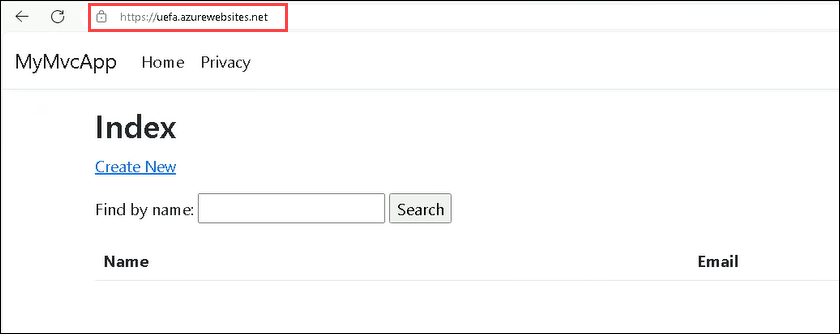

# Challenge 3: Deploy the App to Azure

### Estimated Time: 60 minutes

## Introduction

In the previous challenge, you successfully developed a fully functional **MyMvcApp CRUD Application**, developed mainly with the assistance of **GitHub Copilot**, and also gained valuable insights into how AI can be seamlessly integrated into the development workflow.

As a software developer at **Contoso Ltd.**, a leading software development company, you are tasked with exploring innovative technologies and tools that can enhance the company's software development process and infrastructure management. **Contoso Ltd.** recognizes the potential of Infrastructure as Code (IaC) in managing and provisioning its computing resources and is particularly interested in Azure Resource Manager (ARM) templates for deploying applications to Azure.

In this challenge, you will utilize **GitHub Copilot** to streamline the development of an **Azure Resource Manager (ARM)** template to deploy the fully functional **MyMvcApp CRUD Application** that you developed earlier. ARM templates are Infrastructure as Code (IaC) files used to deploy and manage resources in Azure. By leveraging Copilot's code generation capabilities, you'll expedite the creation of an ARM template for deploying an application to Azure. In addition to this, you will also automate the build and testing processes of your code. You will create a GitHub Actions pipeline, with GitHub Copilot assisting in generating the necessary scripts. To document the knowledge and insights gained from this exercise, you will use **GitHub Copilot** to generate comprehensive and accurate documentation for this challenge. This documentation will serve as a guide for creating the ARM template, setting up the GitHub Actions pipeline, and deploying the fully functional **MyMvcApp CRUD Application** to Azure.

By completing this challenge, you aim to demonstrate to Contoso Ltd. how **GitHub Copilot** can streamline the development of ARM templates, automate build and testing processes with GitHub Actions, and generate insightful documentation. This will further highlight the value of integrating AI into the development workflow, following the successful development of the Contact Database application in the previous challenge.

## Prerequisites

Make sure you have the following from the CloudLabs-provided integrated environment:

> **Note**: Prerequisites are already set up in the CloudLabs provided environment. If you're using your personal computer or laptop, please make sure that all necessary prerequisites are installed to complete this hackathon.

- [Visual Studio Code](https://code.visualstudio.com/)
- [GitHub account](https://github.com/)
- [GitHub Copilot extension](https://marketplace.visualstudio.com/items?itemName=GitHub.copilot) installed in VS Code.
- Make sure to deploy the web app in the existing resource group named **GitHub-Copilot-Challenges**.

## Accessing Azure Portal

1. To access the Azure portal, open a private/incognito window in your browser and navigate to **[Azure Portal](https://portal.azure.com)**.

1. On the **Sign in to Microsoft Azure** tab, you will see a login screen. Enter the following email/username and then click on **Next**. 
   * Email/Username: <inject key="AzureAdUserEmail"></inject>
        
1. Now enter the following password and click on **Sign in**.
   * Password: <inject key="AzureAdUserPassword"></inject>

1. **Skip** the MFA registration if the pop-up appears while logging in to the Azure portal.

1. If you see the pop-up **Stay Signed in?** click No.

1. If you see the pop-up **You have free Azure Advisor recommendations!**, close the window to continue the lab.

1. If a **Welcome to Microsoft Azure** pop-up window appears, click **Maybe Later** to skip the tour.
   
1. Now you will see the Azure Portal Dashboard. Click on **Resource groups** from the Navigate panel to see the resource groups.
  
1. Confirm you have a resource group **GitHub-Copilot-Challenges** present, as shown in the below screenshot. You need to use the **GitHub-Copilot-Challenges** resource group throughout this challenge.

## Challenge Objectives:

1. **Develop an ARM template to deploy an app to Azure:**
   
   - Use GitHub Copilot to assist you in generating the initial structure of an ARM template for deploying the **MyMvcApp CRUD Application** to Azure.
     
   - Define the necessary Azure resources in the ARM template, that is, a **Web App** present in **Azure App Services** required to deploy your application.
     
   - Save the ARM template and parameters files in your **MyMvcApp CRUD Application** GitHub repository as **deploy.json** and **deploy.parameters.json** files on the **master** branch.

   <validation step="93dbb711-57a3-462c-8ffe-699f1208865e" />

3. **Generate a GitHub action workflow using the Deployment Center from the Web App in the Azure portal:**
   
   - Deploy and build workflow code from your Web App **Deployment Center** for the GitHub source **MyMvcApp-Contact-Database-Application** GitHub repository to start the workflow pipeline to deploy your Web app to Azure.
     >**Note:** The build will fail due to the undefined path in your workflow YAML file.
  
   - Specify the path as **D:\a\MyMvcApp-Contact-Databse-Application\MyMvcApp-Contact-Databse-Application\bin\Release\net8.0\MyMvcApp** for the steps **dotnet publish** and **Upload artifact for deployment job** in your workflow file.

   <validation step="019351e9-84ff-4623-a26c-66afe706bf66" />

5. **Get the app working on Azure:**
   
   - Verify that the GitHub Actions pipeline build has succeeded and the app is working as expected through the Web App.
  
     
     
   - Verify that the deployed resources match the specifications outlined in your ARM template and that the application is working from the Azure Web App's **Default Domain**.
  
7. **Generate documentation with Copilot for the app:**
   
   - Use GitHub Copilot to assist you in generating detailed and accurate documentation specifically for this challenge.
     
   - Create an MD file in your **MyMvcApp-Contact-Database-Application** GitHub repository as a **README.md** file on the **master** branch. This will act as a guide in creating an ARM template to deploy the app and the GitHub actions pipeline workflow file.
     
## Success Criteria:

- Verify that the web app from Azure App Services containing your application code is present in Azure.
- Verify that the Github action pipeline was created successfully.
- Verify that the **MyMvcApp CRUD Application** is deployed successfully on Azure and test the functionality.
- Verify that the documentation was created successfully.

## Additional Resources:

- Refer [here](https://learn.microsoft.com/en-us/azure/developer/github/deploy-to-azure) for additional help.
- If you encounter any challenges or have questions, refer to the [GitHub Copilot Documentation](https://github.com/github/copilot-docs) for guidance.

### Challenge Validation
 
Provide the GitHub Username parameter in the **github-cloudlabsuser-XXXX** format for the **Validate GitHub directory** validation step.

## Conclusion

In this challenge,  you've demonstrated how AI can significantly aid in the development and deployment of applications, specifically through the use of GitHub Copilot. Not only did you develop a fully functional Contact Database application in the previous challenge, but you also effectively deployed it to Azure using an ARM template generated with the help of GitHub Copilot. You've utilized GitHub Copilot to streamline the creation of the ARM template, which is a powerful example of Infrastructure as Code (IaC), and also automated the build and testing process of your code by creating a GitHub Actions pipeline, with GitHub Copilot assisting in generating the necessary scripts. Furthermore, you've produced comprehensive and accurate documentation for this challenge, serving as a valuable guide for future projects.

Through this challenge, you've showcased to Contoso Ltd. the potential of integrating AI into the development workflow. You've demonstrated how GitHub Copilot can aid in not only the development of applications but also in the deployment and management of infrastructure, thus highlighting its versatility and value. By successfully deploying the Contact Database application to Azure and verifying its functionality, you've provided a tangible demonstration of the benefits of AI in software development.
