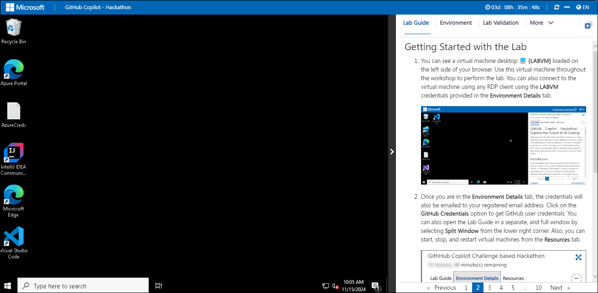
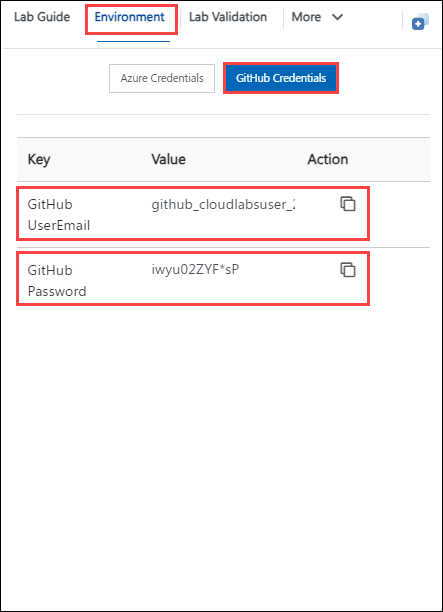
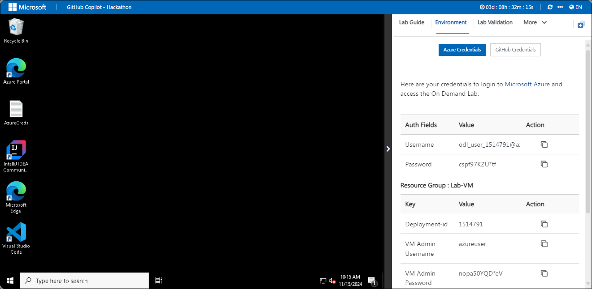
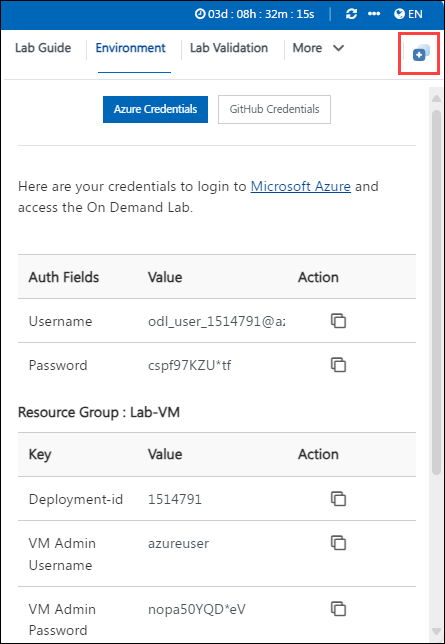
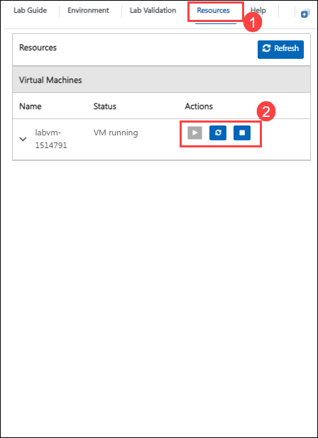

# Getting Started with Your Microsoft Copilot Hackathon Workshop

Welcome to your Microsoft Copilot Hackathon Workshop! We've prepared a seamless environment for you to explore and learn about Microsoft Copilot services. Let's begin by making the most of this experience:

## Accessing Your Lab Environment

Once you're ready to dive in, your virtual machine and lab guide will be right at your fingertips within your web browser.

## Accessing Your GitHub credentials

Once you are in the **Environment** tab, click on the **GitHub Credentials** option to get GitHub user credentials.
The credentials will also be emailed to your registered email address.

### Virtual Machine & Lab Guide
 
Your virtual machine is your workhorse throughout the workshop. The lab guide is your roadmap to success.
 
## Exploring Your Lab Resources
 
To get a better understanding of your lab resources and credentials, navigate to the **Environment** tab.
 

 
## Utilizing the Split Window Feature
 
For convenience, you can open the lab guide in a separate window by selecting the **Split Window** button from the top right corner.
 

 
## Managing Your Virtual Machine
 
1. Feel free to start, stop, or restart your virtual machine as needed from the **Resources** tab. Your experience is in your hands!
 
    

 
1. Click **Next** from the bottom right corner to embark on your Lab journey!
 
    
 
Now you're all set to explore the powerful world of technology. Feel free to reach out if you have any questions along the way. Enjoy your workshop!