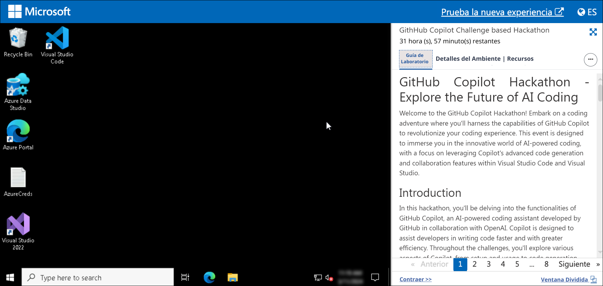
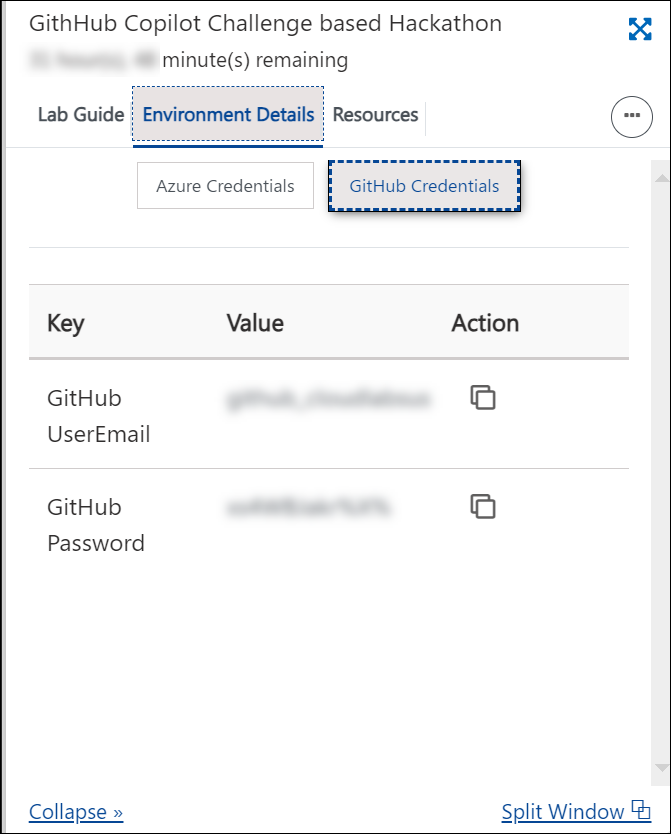

## Getting Started with the Lab

1. You can see a virtual machine desktop 💻 **(LABVM)** loaded on the left side of your browser. Use this virtual machine throughout the workshop to perform the lab. You can also connect to the virtual machine using any RDP client using the **LABVM** credentials provided in the **Environment** tab.

    

1. Once you are in the **Environment** tab, the credentials will also be emailed to your registered email address. Click on the **GitHub Credentials** option to get GitHub user credentials. You can also open the Lab Guide in a separate, and full window by selecting **Split Window** from the lower right corner. Also, you can start, stop, and restart virtual machines from the **Resources** tab.

    
