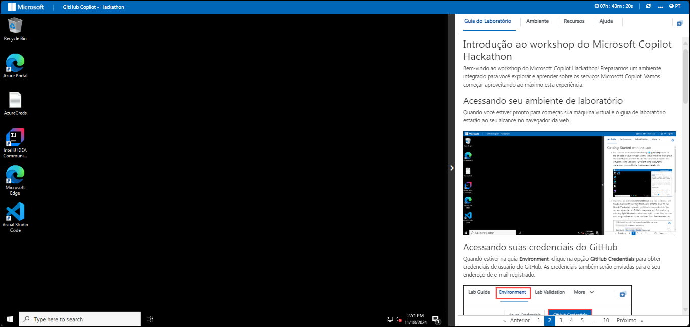
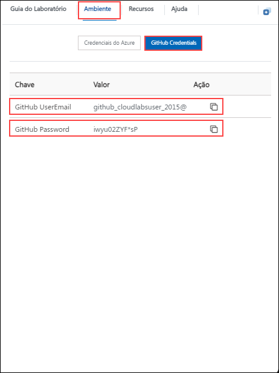
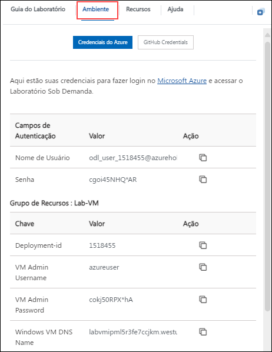
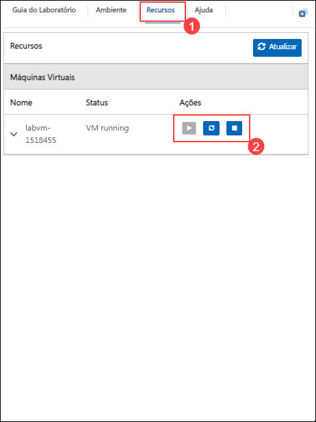

# Introdução ao workshop do Microsoft Copilot Hackathon

Bem-vindo ao workshop do Microsoft Copilot Hackathon! Preparamos um ambiente integrado para você explorar e aprender sobre os serviços Microsoft Copilot. Vamos começar aproveitando ao máximo esta experiência:

## Acessando seu ambiente de laboratório

Quando você estiver pronto para começar, sua máquina virtual e o guia de laboratório estarão ao seu alcance no navegador da web.

## Acessando suas credenciais do GitHub

Quando estiver na guia **Ambiente**, clique na opção **GitHub Credentials** para obter credenciais de usuário do GitHub. As credenciais também serão enviadas para o seu endereço de e-mail registrado.

### Máquina Virtual e Guia de Laboratório

Sua máquina virtual é seu carro-chefe durante todo o workshop. O guia de laboratório é o seu roteiro para o sucesso.

## Explorando os recursos do seu laboratório

Para entender melhor os recursos e credenciais do seu laboratório, navegue até a guia **Ambiente**.

## Utilizando o recurso de janela dividida

Por conveniência, você pode abrir o guia de laboratório em uma janela separada selecionando o botão **Janela dividida** no canto superior direito.

## Gerenciando sua máquina virtual

1. Sinta-se à vontade para iniciar, parar ou reiniciar sua máquina virtual conforme necessário na guia **Recursos**. Sua experiência está em suas mãos!

    

1. Clique em **Próximo** no canto inferior direito para embarcar em sua jornada de laboratório!

    

Agora você está pronto para explorar o poderoso mundo da tecnologia. Sinta-se à vontade para entrar em contato se tiver alguma dúvida ao longo do caminho. Aproveite sua oficina!
